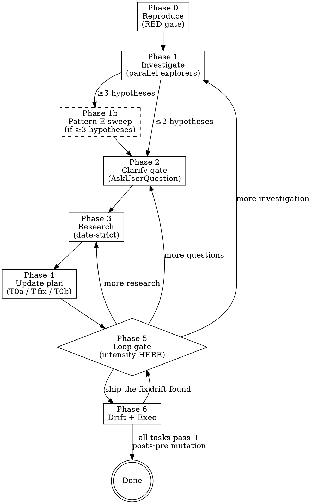

# Loop-debug — Research-driven bug-fixing orchestrator

<HARD-GATE>
You MUST NOT write any production code, invoke `subagent-driven-development`, or call `ExitPlanMode` until ALL of:

(a) the bug is reproduced as a deterministically-failing test (RED gate at end of Phase 0),
(b) root cause + scope of impact are documented (Phase 1, with citations),
(c) the user has explicitly said "ship the fix" / "ship it" / "go" (or equivalent) at Phase 5,
(d) drift check Phase 6 returns CLEAN.

Symptom-fixing without root-cause investigation is a hard violation of this skill's contract. Phase 0 + Phase 1 enforce upstream; the debug-mode spec-reviewer at Phase 6 enforces downstream. If you cannot reproduce the bug as a failing test, STOP and surface that fact to the user — do not move to Phase 1 with an unreproduced bug.
</HARD-GATE>

## What this skill is

A **7-phase looping debugger** built on top of loop-plan's discipline, but inverted from "where to add code" to "where the bug is + what it touches + how to prevent the class of bug recurring":

- **Phase 0 — Reproduce.** Capture inputs/preconditions/env that fire the bug; write a deterministic failing test (the regression test, T0a). RED gate.
- **Phase 1 — Investigate.** Parallel read-only explorers: root-cause trace, scope-of-impact, existing-test-coverage. Auto-trigger Pattern E (Agent Teams) when ≥3 plausible root-cause hypotheses surface.
- **Phase 2 — Clarify.** AskUserQuestion gate on scope (where the fix lives), severity (hotfix vs proper fix), fix-shape (revert / patch / rewrite). No rigor question here — that moves to Phase 5.
- **Phase 3 — Research.** Date-strict internet research on fix patterns for this bug class + prevention strategies (lint / type / contract / invariant / mock-harness). Same hard rules as loop-plan Phase 3 (≥20 sources or honest gap).
- **Phase 4 — Plan.** Emit the three-task split: `T0a-regression-test-<slug>` (already RED from Phase 0) + `T-fix-<slug>` (minimal code change) + `T0b-prevention-design-<slug>` (structured prevention options for user to accept/reject).
- **Phase 5 — Loop gate.** Ship / loop / change intensity. **Intensity (minimal | standard | hardened) surfaces HERE** — after exploration, when the user has context to choose. ADR-0019.
- **Phase 6 — Drift + Exec.** Drift check with bug-specific rules 14–17 added on top of loop-plan's 9–13. On CLEAN: `ExitPlanMode`, then autonomous fix pipeline (RED → impl → GREEN → verify → mutation + post-≥-pre floor per ADR-0014).

## What this skill is NOT

- **Not a replacement for `superpowers:systematic-debugging`.** That skill owns linear root-cause discipline (4 phases, no loop, no research). loop-debug *orchestrates* it for Phase 1 root-cause work.
- **Not an autonomous agent.** Unlike `autoresearch:debug` / `autoresearch:fix`, every iteration ends at a user gate. The user is in the loop by design — see Phase 3 research finding Q2 (SWE-bench inflation) for the empirical justification.
- **Not a one-shot.** If the bug is a typo or a known-pattern fix, just fix it. Use loop-debug when you want root-cause investigation + prevention design + regression coverage, not when you want a fast patch.
- **Not a subagent.** Same reason as loop-plan — calls AskUserQuestion, which is blocked in subagents. Stays in the main thread; dispatches read-only explorers + research-agent + test-writer + test-runner as subagents.

## Differences from loop-plan

| Aspect | loop-plan | loop-debug |
|---|---|---|
| Direction | Forward (new feature, new code) | Backward (existing bug, existing code) |
| Phase 0 | Seed (slug, state, context-load) | Seed + reproduce-as-failing-test (RED gate) |
| Phase 1 | Where to add code (similarity, deps, tests) | Where the bug is + impact radius (root cause, scope, existing test coverage) |
| Phase 3 | Best current solution for new feature | Why does this approach fail + how do teams typically catch + prevent |
| Phase 4 task types | Implementer tasks (T1, T2, …) | T0a-regression-test + T-fix + T0b-prevention-design (3-type split) |
| Rigor selection | Phase 2 Q0 (mandatory upfront) | **Phase 5 (after exploration)** — gives user context to choose. ADR-0019. |
| Pattern E (Agent Teams) | Rare, only on competing hypotheses | **Auto-trigger when Phase 1 surfaces ≥3 root-cause hypotheses** (`CLAUDE_CODE_EXPERIMENTAL_AGENT_TEAMS=1` still required) |
| Drift rules | 9 / 12 / 13 by rigor | Same base + bug-specific rules 14–17 (fix-minimal, regression-reproduces-THIS-bug, post≥pre mutation, T0b emitted for non-LOW risk) |
| Phase count | 11 (0, 1, 2, 3, 3b, 4, 5, 6a, 6b, 7a, 7b) | 7 (0, 1, 2, 3, 4, 5, 6) — collapsed for follow-through |
| Spec-reviewer | Default (feature-spec interpretation) | **Debug-mode override** (regression GREEN + minimal fix + post≥pre + no scope explosion). See [`references/debug-spec-reviewer.md`](references/debug-spec-reviewer.md). |

**Hard caps** (safety only):
- Maximum AskUserQuestion calls per loop iteration: **2**.
- Maximum WebSearch queries per Phase 3: **15** (same as loop-plan).
- Maximum parallel explorer agents per Phase 1: **3** (same as loop-plan).
- Maximum Pattern E teammates per hypothesis sweep: **5** (per `rules/orchestration.md`).
- No cap on total loop iterations — user decides.

**Exit signals** (any ends the loop):
- "Ship the fix" / "ship it" / "go" / "lets fix it" / "looks good" / "поехали" / "погнали" at Phase 5.
- `/ship-it` if defined as alias.

---

## Phase map



---

## Phase 0 — Reproduce (RED gate)

**Announce:** "Using loop-debug skill. I will reproduce the bug as a failing test, investigate root cause + scope, research fix patterns + prevention, and gate every loop iteration at Phase 5."

### Tasks (in order)

1. **Derive slug** from the bug title: lowercase, hyphen-separated, ≤ 40 chars. Example: "feed crashes when offline cache TTL expires" → `feed-cache-ttl-crash`.

2. **Check for resume.** If `~/.claude/plans/<slug>.state.json` exists, read it and jump to `state.current_phase`. Otherwise create fresh state per `references/loop-plan/state-schema.md` with three loop-debug-specific extensions (see § State extensions below).

3. **Read global context** — same as loop-plan Phase 0: `~/.claude/CLAUDE.md` (if it exists), `~/.claude/skills/loop-plan/references/workflow-phases.md`, `~/.claude/skills/loop-plan/references/orchestration.md`, project-local `CLAUDE.md`, project-local `.claude/constitution.md`. Plus: load existing ADRs from `<project>/.claude/decisions/` via `~/.claude/bin/new-adr.py list --root <project-root>`.

3b. **Detect vault-tracked project (per `@rules/expertise-vault.md`).** If `~/Documents/expertise/200-projects/<slug>/` exists for the affected project, read `state.md` (≤100 lines) + TODAY's last `300-activity/` segment if same-day. Store in `state.vault_context`. Older days stay lazy. If absent, `state.vault_context: null` and continue.

4. **Extract the bug signature.** Parse the user's bug report into the 5-tuple structure documented in [`references/bug-reproduction-harness.md`](references/bug-reproduction-harness.md):
   ```
   bug_signature = {
     inputs:                <verbatim input/state that triggers the bug>,
     precondition:          <state required for the bug to fire>,
     assertion_that_fails:  <what the user/code expected>,
     actual_output:         <what actually happened>,
     env:                   <runtime env, OS version, dependency versions, dataset>
   }
   ```
   If any of these 5 fields cannot be extracted from the report, **STOP and ask the user** with a single AskUserQuestion call (counts toward Phase 0's budget — Phase 0 is allowed 1 reproduction-clarifying question if needed).

4b. **Build the feedback loop first (Phase 0a — diagnose model).**
   A failing test is ONE strategy for getting a fast, deterministic, agent-runnable pass/fail signal. Before writing the test, ask: does a clear, deterministic seam exist to write it against?

   Available feedback-loop strategies (from `diagnose/SKILL.md Phase 1`), in preference order:
   1. **Failing test** ← preferred when a clear public API seam exists
   2. **Curl/HTTP script** against dev server with known-bad input
   3. **CLI invocation with fixture** — diff stdout against known-good snapshot
   4. **Headless browser script** (Playwright) for UI/browser bugs
   5. **Replay a captured trace** (har file, log replay, event sequence)
   6. **Throwaway harness** — minimal script that calls the broken code directly
   7. **Property/fuzz loop** — for "sometimes wrong output" bugs (run 100×)
   8. **Bisection harness** — for regressions between commits (`git bisect`)
   9. **Differential loop** — old version vs new version, same inputs
   10. **HITL bash script** — last resort; human interprets output

   **Decision rule:** try strategies 1-3 autonomously (up to 3 attempts). If none yield a reliable pass/fail signal, surface to the user before continuing.

   **Gate:** do not advance to step 5 without a loop you believe in. For non-deterministic bugs (flaky, timing-based, environment-dependent): loop the trigger 100×, parallelize, or narrow timing windows before proceeding.

   **If no correct seam exists:** note this as a structural finding in `state.feedback_loop_note`. This is an architectural signal — proceed with the best available loop, but flag it for the Phase 6 architectural debt handoff (T8 in loop-debug).

   For simple bugs where a test seam is obvious: strategy 1 (failing test) IS the loop — proceed directly to step 5.

5. **Write the regression test (T0a) — must fail RED.** Dispatch the `test-writer` subagent with the bug signature pasted by-value plus the addendum:

   > **Debug-mode test-writer addendum.** This test is a *regression test*, not a feature spec. It MUST fail in a way that *reproduces THIS bug* — same inputs, same precondition, same assertion that the actual code currently fails. Do NOT write a generic "should not crash" test. The failure mode must match `bug_signature.actual_output` verbatim. After writing, run the test once and confirm it fails with the expected error message; if it passes accidentally, report `BUG_NOT_REPRODUCED` — do not silently mark green.

6. **Run the test (RED gate).** Dispatch `test-runner mode: unit` on just the new test. Required outcome: `FAIL` with a message that matches `bug_signature.actual_output`. If GREEN: stop and surface to the user — either the bug is already fixed, or the reproduction is incorrect. Do not advance to Phase 1.

7. **Snapshot the regression test.** `~/.claude/bin/test-integrity.py snapshot --root <project> --task T0a-regression-test-<slug> --files <test paths>`. Locks the test files for the impl phase via the T17 PreToolUse hook (cite ADR-0008).

8. **Write initial state.json** with `current_phase: "1"`, `bug_signature` populated, `red_test_path` recorded.

9. Announce Phase 0 complete + the reproduced failure mode in 1 sentence. Move to Phase 1.

### State extensions (loop-debug-specific)

Three new fields on top of loop-plan's `state.json` schema:

```json
{
  "bug_signature": { "inputs": "...", "precondition": "...", "assertion_that_fails": "...", "actual_output": "...", "env": "..." },
  "root_cause_hypotheses": [
    { "id": "H1", "hypothesis": "...", "evidence": "...", "regression_test_path": "...", "status": "open|disproven|confirmed" }
  ],
  "prevention_recommendations": [
    { "category": "lint-rule|type-constraint|contract-test|runtime-invariant|mock-harness", "rule": "...", "justification": "...", "accepted_by_user": null }
  ]
}
```

Plus the `intensity` field at Phase 5 (mirrors loop-plan's `state.rigor`):

```json
{ "intensity": "minimal|standard|hardened" }
```

---

## Phase 1 — Investigate (parallel read-only explorers)

**Goal:** Map root cause + scope of impact + existing test coverage for the bug. Read-only.

### Subagent dispatch

Dispatch **2–3 read-only explorers in parallel** (single message, multiple Agent tool calls). Each gets ONE domain. Stack-specific (`android-kmp-explorer` for Kotlin/KMP/Compose, `swiftui-explorer` for iOS, generic Explore for web/other):

#### Domain 1 — Root-cause trace

Trace the bug backward from `bug_signature.actual_output` through the call stack. Apply the methodology in `superpowers:systematic-debugging` (`root-cause-tracing.md`) — find where the bad value originates, not where it surfaces. Return:

- **Originating call site** (file:line where the bad value is first produced).
- **Propagation chain** (every hop from origin to surface).
- **Root-cause hypotheses** — list each plausible "the bug exists because X" with evidence (code citation) and a *cheap discriminator* (a one-line check that would prove or disprove it). Limit 5 hypotheses; if more, rank by likelihood + cite all.

#### Domain 2 — Scope of impact

For the buggy code path, find every entry point that can hit it. Return:

- **Direct callers** (functions/components that call the buggy code).
- **Transitive callers** (up to 2 hops out — beyond that, list as "wider scope" without enumerating).
- **External entry points** that hit the buggy path (HTTP routes, intents, deep links, background jobs, scheduled tasks).
- **Data flows** — what state passes through the buggy code; where else does the same state shape exist (potential same-class bug elsewhere).

#### Domain 3 — Existing test coverage

For the buggy code + the entry points found in Domain 2, find existing tests. Return:

- **Tests that cover the buggy path** (file:line, what they assert).
- **Tests that should have caught the bug but didn't** (gaps).
- **TestPrune-style minimal set** — the smallest test set that exercises the bug surface across all entry points (per Phase 3 finding Q1 — large suites add noise to LLM debugging).
- **Coverage classification** per touched file: none / unit only / integration only / both.

### H1 — Always-on Codex root-cause explorer (per ADR-0023, tier-gated)

At `state.intensity ∈ {standard, hardened}` (skip at `minimal`), dispatch one Codex root-cause hypothesizer **in parallel with the 3 Claude explorers**. Use `codex-rescue` agent with the prompt: *"Propose 1-3 plausible root-cause hypotheses for this bug. Read-only. Cite file:line. Each must include a cheap discriminator test."* Background, foreground via `--wait`. Latency budget 2-10 min. Result folds into Domain-1 hypothesis list with `source: codex`. Cost-gated by ADR-0024 (`should-run-codex.py` on the touched file set) — skip if trivial. Cross-vendor independence directly counters intra-vendor homogenization risk (F16). Cite ADR-0023.

### Pattern E auto-trigger (≥3 hypotheses)

If Domain 1 returns ≥3 plausible root-cause hypotheses **with non-trivial evidence each** (i.e. each one cites real code and explains the failure), auto-dispatch Pattern E adversarial Agent Teams (cite `rules/orchestration.md` § Pattern E):

- Requires `CLAUDE_CODE_EXPERIMENTAL_AGENT_TEAMS=1`. If the env var is not set, surface to the user: *"3+ hypotheses found. Pattern E (Agent Teams) recommended but `CLAUDE_CODE_EXPERIMENTAL_AGENT_TEAMS=1` is not set. Run `export CLAUDE_CODE_EXPERIMENTAL_AGENT_TEAMS=1` and re-invoke, or pick the most likely hypothesis manually."*
- One teammate per hypothesis. Each owns: (a) writing a *targeted regression test* that fires only if their hypothesis is correct, (b) running it, (c) reporting CONFIRMED / DISPROVEN. Cap teammates at 5.
- Lead synthesizes: whichever hypothesis's targeted regression test fires reliably wins. If none fire reliably, surface as *"no hypothesis confirmed; user must adjudicate."*
- Update `state.root_cause_hypotheses[]` with `status: confirmed|disproven` per teammate.

### After explorers return

- Run the **automated citation verifier** on each report:
  ```bash
  ~/.claude/bin/verify-code-research.py /tmp/explorer-report-<domain>.md --json > /tmp/explorer-verify-<domain>.json
  ```
  Drop any FAIL or OFF_BY_ONE citations from the plan; surface as Phase 1 verification gaps.
- Synthesize 1 paragraph per domain into the plan's `## Investigation findings` section.
- Increment `state.iteration` if this is a re-entry.

### Hard rules for Phase 1 explorer prompts

- Read-only tools only (Read, Grep, Glob). No Write/Edit/Bash.
- Each prompt pastes `bug_signature` by-value, plus the originating-line from `state.red_test_path`.
- Do NOT instruct the explorer to "re-Read every cited file before returning" — same anti-pattern as loop-plan. Audit-tested: this burns turn budget. The orchestrator-side citation verifier is the safety net.
- Cap turn budget at 30; if approaching the cap, deliver partial report with `(unverified)` markers rather than no report.

---

## Phase 2 — Clarify gate (AskUserQuestion)

**Goal:** Resolve scope/severity/fix-shape ambiguities before research burns tokens. **No rigor question here** — intensity selection moves to Phase 5 (ADR-0019).

### Standard clarifications

Up to **4 questions per AskUserQuestion call, max 2 calls per Phase 2 entry**. Same shape as loop-plan Phase 2:

- **Scope:** Where should the fix live? Options: original origin (deepest); intermediate guard (defense-in-depth); entry-point validator (cheapest); multiple sites (defense-in-depth full).
- **Severity:** Hotfix (minimal patch, fix lands today), proper fix (root-cause + prevention), proper fix + tech-debt write-up (defer broader cleanup as ADR).
- **Fix-shape:** Patch the bad path, revert the change that introduced it (if known via git blame), rewrite the buggy unit.
- **Acceptance criteria:** What does "fixed" mean to the user beyond "T0a passes GREEN"? (E.g. specific user flow works, specific perf number holds, specific log line goes silent.)

### Auto-write architecture-tagged clarifications as ADRs

Same heuristic as loop-plan Phase 2 (cite ADR-0004). For each architecture-tagged answer (headers in the whitelist — `Architecture`, `Pattern`, `Storage`, `DI`, `State`, `API`, `Auth`), call:

```bash
~/.claude/bin/new-adr.py create --root <project-root> --slug <kebab-slug> --title "<title from answer>"
```

Status `proposed` until Phase 6 task pass flips to `accepted`. Record in `state.adrs_created[]`.

### Hard rules

- ≤ 4 questions per call, ≤ 2 calls per Phase 2 entry.
- Recommended option first, labeled "(Recommended)".
- Header ≤ 12 chars.
- Never ask "does the plan look good?" — that's Phase 5's job.
- Never reference plan-file content the user may not have seen.
- **Never ask about rigor/intensity at Phase 2** — that's Phase 5's job per ADR-0019. Asking here is a hard violation.

---

## Phase 3 — Research (date-strict)

**Goal:** Fix patterns for THIS bug class + prevention strategies. Same hard rules as loop-plan Phase 3 (date-strict, ≥20 sources or honest gap, sentiment balance), with debug-specific scoping.

### Decide research mode

| Topic shape | Mode | Tool |
|---|---|---|
| Bug is a known library quirk (e.g. "Room 3 KSP migration broke compile") | **A — context7 only** | `mcp__context7__resolve-library-id` → `query-docs`. No subagent. |
| Single domain bug + single prevention class to research | **B — single research-agent subagent** | One dispatch, background OK. |
| Bug surface spans ≥3 independent research domains (root-cause class, fix idiom, prevention strategy each separate) | **C — parallel research-agents (max 3)** | Single message, multiple Agent calls. |
| Truly novel + cross-disciplinary (race conditions involving custom protocols, hardware-specific bugs) | **D — `deep-researcher` skill in main session** | Last resort — bloats orchestrator. |

### Mandatory sub-questions for any debug research

Always cover at minimum:

1. **Best practice for fixing THIS class of bug** — not just THIS bug, but the class.
2. **Common mistakes when fixing this bug class** — what looks like a fix but isn't, what introduces follow-on bugs.
3. **Prevention strategies** for this bug class — lint rules, type constraints, contract tests, runtime invariants, mock harnesses. Cite [`references/prevention-design.md`](references/prevention-design.md) decision tree.
4. **How do teams typically catch this bug** — what test pattern or production signal usually surfaces it. (If no good answer: prevention is harder; surface as a risk in Phase 4.)
5. **Negative / skeptical sources** for the proposed fix idiom — sentiment balance per loop-plan Phase 3 hard rule 7.

### Hard rules (same as loop-plan Phase 3, copied verbatim)

1. Every WebSearch query MUST include a date constraint per [`references/loop-plan/date-filter.md`](../loop-plan/references/date-filter.md). Baseline: `<topic> after:2025-10-01 2026`.
2. Every query MUST include the current year in the query text.
3. Every fetched page MUST have its date verified (`<meta>`, `<time>`, JSON-LD, visible date).
4. Minimum sources: 20 across modes B/C/D (Mode A returns fewer because context7 is authoritative). Sources without verifiable post-2025-10-01 dates are discarded, not cited.
5. Prefer fresh domains: arxiv.org, github.com, code.claude.com, claude.com, anthropic.com, official library docs, GitHub issues/PRs.
6. Sentiment balance — at least one negative/skeptical source per major claim. If none after 3 searches, note as a gap.
7. **Never invoke the Skill tool from a subagent prompt** — subagents have no Skill tool. Inline the date-filter rules instead.

### Subagent template (Modes B and C)

Same skeleton as loop-plan Phase 3, with the debug-specific addendum:

> Your research must answer (1) best practice for fixing THIS bug class, (2) common mistakes when fixing this class, (3) prevention strategies (lint/type/contract/invariant/mock-harness), (4) how teams typically catch this bug, (5) ≥1 skeptical source on the proposed fix idiom. Bug signature: `{paste verbatim from state}`. Root-cause hypothesis (if known): `{paste verbatim from Phase 1 confirmed hypothesis or "open"}`.

### Run citation verifier on every report

```bash
~/.claude/bin/verify-internet-research.py /tmp/research-report.md --json
```

Drop FAIL/UNDATED citations.

### Append to plan

Write `## Research findings — iteration <N>` section. Cite each source with date + URL. Note all gaps honestly.

---

## Phase 4 — Plan (T0a / T-fix / T0b emission)

**Goal:** Emit the three-task split.

**Cross-reference (per trigger-system loop):** loop-plan's Phase 4 now auto-suggests Pattern C (Orchestrator-Worker) when Phase 1 surfaces ≥3 independent research domains. Loop-debug already auto-fires Pattern E (Agent Teams) when ≥3 competing hypotheses surface in Phase 1. When picking implementer / reviewer shortlists, consult `~/.claude/data/triggers.json` for the canonical bilingual trigger catalog (rank candidates by trigger-match score against task description).

### H3 — Codex review of T0a/T-fix/T0b triplet (per ADR-0023, tier-gated)

After the triplet is drafted in Phase 4 (sub-phase 4b), at `state.intensity ∈ {standard, hardened}`:

1. Run cost gate: `~/.claude/bin/should-run-codex.py --base <pre-loop sha> --head HEAD`. If SKIP → skip Codex review.
2. Else dispatch `second-opinion` with `stage: plan, target: <plan-path>` (routes through `~/.claude/bin/run-codex-review.sh`).
3. Codex prompt embeds the 4-ingredient template (F34): *Goal: validate bug-fix triplet. T-fix touches only files implicated by the confirmed root cause (drift rule 14). T0a reproduces THIS bug specifically (drift rule 15). T0b proposes prevention for the bug class.* Codex returns structured findings.
4. Write findings to plan's `## Second opinion — triplet` section. Advisory; never blocks.

Cite ADR-0023, ADR-0024.

### Task type contract

Every fix in loop-debug emits exactly three tasks (one of each type per bug):

#### T0a — `T0a-regression-test-<slug>`

- **Status:** Already RED from Phase 0. Re-listed here for plan completeness.
- **TDD:** `test files: <paths from state.red_test_path>`; `coverage target: per intensity tier (see Phase 5)`; `mutation tool: per stack`; `mutation threshold: per intensity tier`.
- **Anti-tamper:** test files locked via T17 hook + `_active_task_files.txt` until T-fix verifies.
- **Reviewer:** none for T0a (test was written by test-writer in Phase 0 and verified RED).

#### T-fix — `T-fix-<slug>`

- **Implementer prompt addendum:**
  > Debug-mode fix. Constraints:
  > 1. Make T0a pass GREEN.
  > 2. Touch the *minimum* code necessary. If you spot refactoring opportunities, report `DONE_WITH_CONCERNS — refactor_recommended` and DO NOT refactor inside this task.
  > 3. Do NOT modify the test files in `_active_task_files.txt` — they are read-only.
  > 4. Cite the confirmed root-cause hypothesis from `state.root_cause_hypotheses[]` in your fix commit message.
- **Reviewer:** debug-mode `spec-reviewer` (override per [`references/debug-spec-reviewer.md`](references/debug-spec-reviewer.md)) → `code-quality-reviewer` (dimensions 9–10 always; 11 if intensity=hardened).
- **Mutation gate:** `test-runner mode: mutation` after GREEN. Threshold per intensity (see Phase 5). **Post-fix score MUST be ≥ pre-fix score per ADR-0014.** Hard-block on regression.

#### T0b — `T0b-prevention-design-<slug>`

- **Output:** structured list of prevention recommendations, one per category from [`references/prevention-design.md`](references/prevention-design.md):
  - `lint-rule`
  - `type-constraint`
  - `contract-test`
  - `runtime-invariant`
  - `mock-harness`
- **No implementation.** This task emits the *list*; the user picks which (if any) to land as follow-up tasks. Mirrors loop-plan's T0a-char-test prereq pattern (ADR-0014).
- **When:** auto-emitted for MED/HIGH-risk bugs (per the Phase 1 risk classification from Domain 3 — bugs that crashed in production, bugs in hot code paths, security bugs). LOW-risk bugs (typos in error messages, dev-only logging gaps) skip T0b unless user opts in.
- **Reviewer:** none — output is advisory.

### Plan file structure (the markdown layout loop-debug emits)

```markdown
# <Bug title> — Loop Debug

**Status:** draft — iteration N
**Created:** <ISO date>
**Loop skill:** loop-debug v1
**Intensity:** <set at Phase 5>

## Bug statement
<verbatim user statement>

## Bug signature
<5-tuple from state.bug_signature>

## Investigation findings
_Filled in Phase 1 (root cause + scope + existing-coverage)_

## Clarifications
_Filled in Phase 2_

## Research findings
_Filled in Phase 3_

## Tasks

### T0a — regression-test-<slug>
…

### T-fix — fix-<slug>
…

### T0b — prevention-design-<slug>
…

## Architecture & clean-code design
_Same § layout as loop-plan; cite affected ADRs + new ADRs created from clarifications_

## Test plan
_Per intensity tier_

## Orchestration design
_Pattern selection, task→agent table, DAG_

## Drift check
_Filled in Phase 6_
```

### Cite ADRs

- ADR-0007 (RED→GREEN), ADR-0008 (anti-tamper), ADR-0009 (mutation gate), ADR-0010 (per-task test specs), ADR-0014 (mutation floor — primary safety net), ADR-0019 (this skill).
- Plus any project-local ADRs surfaced at Phase 0.

---

## Phase 5 — Loop gate (with intensity selection)

**Goal:** User decides ship / loop / change intensity. **Intensity selection happens HERE** per ADR-0019, not at Phase 2 Q0.

### First Phase 5 entry (intensity choice)

If `state.intensity` is not yet set, the Phase 5 AskUserQuestion **must include the intensity question first**:

```json
{
  "questions": [{
    "question": "How much rigor should the fix pipeline enforce?",
    "header": "Intensity",
    "multiSelect": false,
    "options": [
      {"label": "Standard (Recommended)", "description": "RED→fix→GREEN→verify→mutation pipeline. Mutation threshold 80/60/50 per stack. Post-fix mutation ≥ pre-fix (ADR-0014). T0b prevention emitted for MED/HIGH-risk bugs. Best for normal production bug fixes."},
      {"label": "Minimal", "description": "RED→fix→GREEN only. No mutation gate, no T0b prevention. Best for hotfixes, prototypes, dev-only fixes. Always-on hygiene (self-describing, principles) still applies."},
      {"label": "Hardened", "description": "Standard + dimension-11 reviewer (refactor-trajectory) + tightened mutation thresholds (90/70/60) + T0b prevention mandatory regardless of risk + post-fix security-reviewer pass. Best for security bugs, payment bugs, data-loss bugs, anything user-facing in core flows."}
    ]
  }]
}
```

Followed by (same call) the standard ship/loop question.

### Subsequent Phase 5 entries (intensity already set)

Skip the intensity question; just ship/loop/back-to-X.

### H4 — Codex pre-shipit second-opinion (per ADR-0023, tier-gated)

BEFORE the AskUserQuestion ship/loop gate fires (at first Phase-5 entry only), at `state.intensity ∈ {standard, hardened}`:

1. Cost gate via `should-run-codex.py` on the draft triplet.
2. Dispatch `second-opinion` `stage=plan, target=<plan-path>`.
3. Surface Codex findings (count by severity) INLINE in the AskUserQuestion description block so the user sees DISAGREES count before choosing "ship it".
4. Skip at `state.intensity == minimal`.

Cite ADR-0023.

### Standard ship/loop question

```json
{
  "questions": [{
    "question": "Does the plan look complete? What next?",
    "header": "Next step",
    "multiSelect": false,
    "options": [
      {"label": "Ship the fix", "description": "Lock the plan, run drift check, execute T0a + T-fix + T0b autonomously."},
      {"label": "More investigation", "description": "Re-run Phase 1 explorers (e.g. broader scope, different angle)."},
      {"label": "More research", "description": "Re-run Phase 3 (e.g. specific library/idiom, prevention deep-dive)."},
      {"label": "More questions", "description": "Re-issue Phase 2 clarifications."},
      {"label": "Change intensity", "description": "Re-pick intensity tier."}
    ]
  }]
}
```

### Honor exit signals before issuing the question

If user has already typed any exit-signal keyword in the current loop iteration, skip the AskUserQuestion and treat as "Ship the fix."

---

## Phase 6 — Drift + Exec

### Phase 6a — Drift check (sub-agent)

Same dispatch as loop-plan Phase 6a (sonnet, read-only, Read/Grep/Glob), but with the **debug-specific drift rules** per [`references/debug-drift-rules.md`](references/debug-drift-rules.md). Loop-plan's 9 base rules apply unchanged + 4 bug-specific rules:

| # | Rule | Tier applicability |
|---|---|---|
| 1–9 | (loop-plan base) | All intensities |
| 10–12 | (loop-plan TDD-tier rules) | standard + hardened |
| 13 | (loop-plan refactor-trajectory rule) | hardened only |
| **14** | **Fix-scope is minimal** — T-fix touches only files implicated by the confirmed root-cause hypothesis. Refactoring outside that scope is DRIFT. | All intensities |
| **15** | **Regression test reproduces THIS bug** — T0a's failure message at RED matches `bug_signature.actual_output`, not "any failure." | All intensities |
| **16** | **Post-fix mutation ≥ pre-fix mutation** — drift-check verifies the plan emits the post-≥-pre check; runtime enforcement is at Phase 6b. | standard + hardened |
| **17** | **T0b prevention emitted for non-LOW-risk bugs** — if `state.bug_risk` ∈ {MED, HIGH}, T0b must appear in the plan; orphaned absence is DRIFT. | standard (when risk≥MED) + hardened (always) |

If verdict is **DRIFT**: surface findings to user, return to Phase 5 (the loop gate). Do NOT auto-fix.

### Phase 6c — Codex post-fix diff review (per ADR-0023, tier-gated)

After T-fix GREEN + mutation post≥pre verified, BEFORE marking the loop shipped:

1. Cost gate via `should-run-codex.py --base <pre-loop sha> --head HEAD`. If SKIP → skip Codex review.
2. Else dispatch `second-opinion` `stage=diff, base=<pre-loop sha>, head=HEAD`.
3. Codex performs adversarial review (structured output, severity-tagged findings).
4. Write findings to plan's `## Second opinion — post-fix` section.
5. Advisory ONLY — never blocks. HIGH findings surface as one-line warning.
6. Skip at `state.intensity == minimal`.

**Note (F37):** post-fix cross-model review is novel territory (no published team has shipped this pattern). Track via T9 `measure-codex-independence.py`. If Codex disagreement rate < 5% over 4 weeks → independence audit needed.

Cite ADR-0023, ADR-0024.

### Phase 6b — ExitPlanMode + autonomous fix execution

On Phase 6a CLEAN:

1. **Print 1-paragraph summary** for the user (what was found, what will be fixed, what prevention is offered).
2. **Call `ExitPlanMode`** with the plan content.
3. **On user approval, execute the DAG:**
   - **T0a** is already RED from Phase 0 — verify with `test-runner mode: unit` that it still fails.
   - **T-fix:**
     - Pre-mutation snapshot: `test-runner mode: mutation --baseline-only` to record pre-fix score. Store as `state.mutation_pre`.
     - Dispatch implementer (model: opus 4.7) with the debug-mode addendum.
     - `test-runner mode: unit` until GREEN.
     - `test-integrity.py verify` — abort task if test files were tampered with.
     - Dispatch debug-mode `spec-reviewer` (per [`references/debug-spec-reviewer.md`](references/debug-spec-reviewer.md)) → `code-quality-reviewer` (model: opus 4.7).
     - `test-runner mode: mutation` — record post-fix score as `state.mutation_post`.
     - **Post ≥ pre check (ADR-0014):** if `state.mutation_post < state.mutation_pre`, HARD-BLOCK. Surface to user with the surviving mutants. Do not advance.
   - **T0b:**
     - Dispatch a single research/synthesis pass (no implementer) that produces the structured prevention list per [`references/prevention-design.md`](references/prevention-design.md).
     - Append to plan; do not execute.
4. **Hardened intensity additions:**
   - `code-quality-reviewer` runs with dimension 11 enabled.
   - `security-reviewer` background pass after T-fix GREEN.
   - Mutation thresholds: 90 / 70 / 60 (vs 80 / 60 / 50 default per ADR-0009).
5. **Promote ADRs to accepted.** For each ADR created at Phase 2 with `accepted_via_task: T-fix-<slug>`, promote `proposed → accepted` via `~/.claude/bin/new-adr.py accept`. Append Confirmation entries.
6. **Update plan status to `shipped`** and write final state.json.

### Failure handling

- **Implementer fails** (turn budget / tool error): surface, ask user to retry, escalate, or abort.
- **Test won't go GREEN after fix**: return to Phase 1 with the new evidence; the hypothesis was wrong.
- **Mutation post < pre**: HARD-BLOCK. Re-dispatch implementer with the surviving-mutant report; do not ship a degraded safety net.
- **Drift after re-loop**: max 3 drift cycles; on 4th DRIFT verdict, surface to user that the plan has structural problems and needs manual restructure.

### Architectural debt handoff (Phase 6 post-mortem)

After all tasks pass and the fix is shipped, ask: "What would have prevented this bug?"

If the answer involves structural issues — no good test seam found at Phase 0a step 4b, tangled callers Phase 1 revealed, hidden coupling that made isolation impossible — explicitly surface a recommendation to the user:

> "This fix patched the symptom. The root structural issue is: [finding from Phase 0a feedback-loop note / Phase 1 explorers].
> Consider: `/improve-codebase-architecture` — deepening the [module name] module to create a proper seam for testing this class of bug."

Record the recommendation in the plan's `## Execution complete` section as an **Architectural debt note**. Use state field `state.feedback_loop_note` (set at Phase 0a step 4b) to populate this note.

**Hard rules:**
- Do NOT block the fix on this recommendation — ship the fix first, advisory second.
- If `state.feedback_loop_note` is null (test seam was clean), skip this section.
- Never write a vague "improve architecture" note — name the specific module and the seam that was missing.

---

## Anti-patterns (don't do these)

| Anti-pattern | Why it fails |
|---|---|
| Fix without RED test first | Symptom-fixing. T0a is the contract — without RED, no proof the fix actually addresses the bug. |
| Asking rigor at Phase 2 Q0 | ADR-0019 — user has no context to choose at Phase 2. Move to Phase 5. |
| `T-fix` task that "also refactors while I'm here" | Drift rule 14. Refactor must be a separate task with its own char-test prereq + post≥pre mutation. |
| `T0a` test that asserts "no crash" instead of reproducing the bug | Drift rule 15. Generic asserts pass for the wrong reason; the next regression won't catch the same bug. |
| Skipping mutation gate at standard intensity | ADR-0014. Silent test-suite degradation is the single biggest risk in fix work. |
| Skipping T0b for HIGH-risk bugs | Drift rule 17. The whole point of loop-debug over a regular fix is preventing the *class* of bug, not just THIS bug. |
| Spawning Pattern E with <3 hypotheses | Cost without benefit. Pattern E's value is competing-hypothesis disambiguation. |
| Subagent re-Read of cited files (audit-by-fetch) | Same anti-pattern as loop-plan. Burns turn budget. Orchestrator-side citation verifier is the safety net. |
| Re-using loop-plan's spec-reviewer prompt unchanged | Default spec-reviewer assumes feature-spec; for debug, the spec is implicit (see [`references/debug-spec-reviewer.md`](references/debug-spec-reviewer.md)). |
| Phase 0 reproduction skipped because "the bug is obvious" | Hard violation. The reproduction IS the proof. |

---

## Reference map

### Loop-debug-specific (this skill's `references/` folder)

- [`references/bug-reproduction-harness.md`](references/bug-reproduction-harness.md) — Phase 0 input format, extraction heuristics, test-writer addendum.
- [`references/prevention-design.md`](references/prevention-design.md) — 5 prevention categories + decision tree by bug class.
- [`references/debug-drift-rules.md`](references/debug-drift-rules.md) — drift rules 14–17 (extends loop-plan's 9–13).
- [`references/debug-spec-reviewer.md`](references/debug-spec-reviewer.md) — debug-mode addendum that overrides spec-reviewer's default feature-spec interpretation.

### Inherited from loop-plan (cross-link, do not duplicate)

- [`../loop-plan/references/state-schema.md`](../loop-plan/references/state-schema.md) — `state.json` schema (loop-debug adds `bug_signature`, `root_cause_hypotheses`, `prevention_recommendations`, `intensity`, `mutation_pre`, `mutation_post`).
- [`../loop-plan/references/tdd-workflow.md`](../loop-plan/references/tdd-workflow.md) — RED→GREEN→verify→mutation pipeline (loop-debug uses verbatim).
- [`../loop-plan/references/drift-check.md`](../loop-plan/references/drift-check.md) — base rules 1–13 (loop-debug extends with rules 14–17 in `debug-drift-rules.md`).
- [`../loop-plan/references/tool-inventory.md`](../loop-plan/references/tool-inventory.md) — agent inventory (loop-debug uses same).
- [`../loop-plan/references/decision-tracking.md`](../loop-plan/references/decision-tracking.md) — ADR protocol (loop-debug uses same).
- [`../loop-plan/references/design-and-quality.md`](../loop-plan/references/design-and-quality.md) — universal principles + 11 reviewer dimensions (loop-debug uses same).
- [`../loop-plan/references/date-filter.md`](../loop-plan/references/date-filter.md) — Phase 3 date-strict rules (loop-debug uses verbatim).
- [`../loop-plan/references/design-and-quality.md`](../loop-plan/references/design-and-quality.md) — Phase 4 § Architecture & clean-code design schema (loop-debug uses same).
- [`../loop-plan/references/orchestration-design.md`](../loop-plan/references/orchestration-design.md) — Phase 4 § Orchestration design schema (loop-debug uses same).
- [`../loop-plan/references/implementer-prompt-addendum.md`](../loop-plan/references/implementer-prompt-addendum.md) — base implementer addendum (loop-debug's T-fix layers debug-mode constraints on top).

### External tools

- `~/.claude/bin/test-integrity.py` — snapshot/verify/lock-task.
- `~/.claude/bin/verify-code-research.py` — Phase 1 citation verifier.
- `~/.claude/bin/verify-internet-research.py` — Phase 3 citation verifier.
- `~/.claude/bin/new-adr.py` — ADR create/confirm/accept.
- `superpowers:systematic-debugging` (`root-cause-tracing.md`, `defense-in-depth.md`, `condition-based-waiting.md`) — Phase 1 root-cause methodology.

---

## Summary contract

When loop-debug ships a fix, the user gets:

1. A **deterministically-failing regression test** that reproduces the specific bug (T0a, locked).
2. A **minimal fix** that makes T0a GREEN without weakening the existing safety net (T-fix, mutation post ≥ pre).
3. A **structured prevention list** for the bug class (T0b, advisory, user picks which to land).
4. Updated ADRs reflecting any architecture decisions surfaced at Phase 2.

Anything less is not a loop-debug ship — it's a regular fix using a heavier process than needed.
