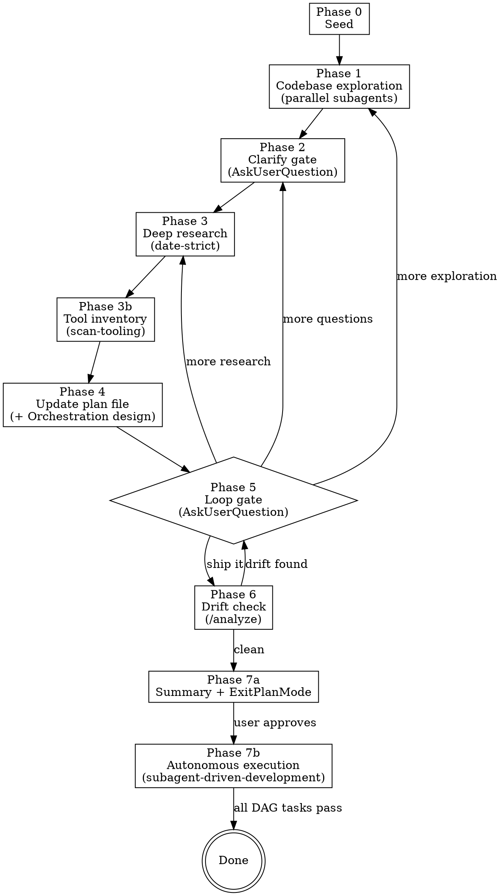

# Loop Plan — Iterative Research-Driven Planner

<HARD-GATE>
You MUST NOT write any code, invoke `subagent-driven-development`, or call `ExitPlanMode` until the user has explicitly said "ship it" (or an equivalent keyword) AND the drift check in Phase 6 passes. Every loop iteration must end with a user-facing gate. No exceptions.

After ExitPlanMode (Phase 7a) and user approval, autonomous execution (Phase 7b) starts immediately. The previous post-ship compact gate was removed per ADR-0018 (user found it too strict). The orchestrator's accumulated context is acceptable; subagents already get task text by-value (per `rules/orchestration.md` golden rule 5) so their budgets stay clean regardless.
</HARD-GATE>

## What this skill is

A **looping** planner that alternates codebase research, interactive questions, and strict-date internet research until the user explicitly chooses to exit. Built on top of Claude Code's native plan mode — writes to `~/.claude/plans/<slug>.md`, maintains state in `~/.claude/plans/<slug>.state.json`, reads back through `ExitPlanMode` on ship.

**Exit signals** (any of these ends the loop):
- User selects "Ship it" in the Phase 5 gate question
- User types any of: `ship it`, `start working`, `go`, `lets build`, `build it`, `looks good`, `поехали`, `начинай`, `погнали` — in any message since the loop started
- User types `/ship-it` (if defined as an alias)

**Hard caps** (safety only — not a budget the user has to use):
- Maximum AskUserQuestion calls per phase entry: **2** (each call 1–4 questions × 2–4 options). Phase 2 Q0 is a separate exempt call; Phase 2a vision grilling uses at most one additional call.
- Maximum WebSearch queries per research phase: **15**
- Maximum parallel explorer agents dispatched per exploration phase: **3** (default is 1-2; scale to 3 only for cross-cutting tasks)
- No cap on total loop iterations — user decides.

## What this skill is NOT

- **Not a one-shot planner.** If the task is trivial, use `superpowers:brainstorming → superpowers:writing-plans` instead.
- **Not a requirements-only skill.** Requirements are Phase 2. This skill owns the full loop through final plan.
- **Not an implementer.** Terminal state hands off to `superpowers:subagent-driven-development` via `ExitPlanMode`.
- **Not a subagent.** This skill runs in the main agent because it calls `AskUserQuestion`, which is blocked in subagents. Explorer and researcher work is delegated to subagents, but the orchestrator stays in the main thread.

---

## Phase map



---

## Phase 0 — Seed

Announce at start: "Using loop-plan skill. I will loop through exploration → questions → research → plan until you say ship it."

**Tasks (in order):**

1. **Derive the slug** from the task statement: lowercase, hyphen-separated, ≤ 40 chars. Example: "add offline caching to the feed" → `offline-feed-caching`.

2. **Check for resume**:
   ```bash
   if [ -f ~/.claude/plans/<slug>.state.json ]; then
     echo "Resuming from state"
   fi
   ```
   If state.json exists, read it and jump to the phase recorded in `state.current_phase`. Otherwise create fresh state per `references/state-schema.md`.

   **Special resume case — Phase 5 mid-loop:** if `state.current_phase == "5"`, you're returning to the loop gate after research/exploration completed. Re-issue the AskUserQuestion gate.

   **Note (ADR-0018):** the previous post-ship compact gate (old Phase 7b) was removed. State files written before 2026-04-28 may carry `awaiting_compact: true` / `current_phase: "7b"`; treat those as `current_phase: "7b"` (autonomous execution) and proceed.

3. **Read global context**:
   - `~/.claude/CLAUDE.md` (if it exists — users who installed from the public package may not have this)
   - `~/.claude/skills/loop-plan/references/workflow-phases.md`
   - `~/.claude/skills/loop-plan/references/orchestration.md`
   - Any project-local `CLAUDE.md` in the current working directory
   - Project-local `.claude/constitution.md` if it exists (SDD per-project facts)

3a. **Detect project root and load existing ADRs.**
   Walk up from CWD to find `.git`. If a project root is detected and `<project-root>/.claude/decisions/` exists:
   ```bash
   ~/.claude/bin/new-adr.py list --root <project-root>
   ```
   Returns one line per ADR: `NNNN | status | title`. Store the summaries in `state.project_decisions[]`. **Do not read full ADR bodies upfront** — those are read on demand at Phase 4 when an ADR is cited or contradicted. Cite ADR-0001 (storage hybrid) for the layout rationale. Reference: [`references/decision-tracking.md`](references/decision-tracking.md).

3b. **Detect vault-tracked project (per `@rules/expertise-vault.md`).**
   If `~/Documents/expertise/200-projects/<slug>/` exists for the current task's project (slug derived from CWD basename or task statement), read:
   - `~/Documents/expertise/200-projects/<slug>/state.md` (current goal, blockers, next-actions; read first 100 lines max)
   - `~/Documents/expertise/300-activity/<slug>/<YYYY>/<YYYY-MM-DD>.md` last segment ONLY if same-day file exists (older days stay lazy — token efficiency)

   Store summaries in `state.vault_context`. If vault paths missing, set `state.vault_context: null` and continue silently. **Hard rule:** never read older `300-activity/` days; only TODAY's last segment.

   **Note for public installs:** vault integration is personal infrastructure. If `~/Documents/expertise/` does not exist, skip step 3b entirely and set `state.vault_context: null`. This is not an error.

3c. **Detect project documentation conventions.**
   Walk the project root (up to 2 levels) for documentation indicators:
   - `CONTEXT.md` — domain glossary (used by `improve-codebase-architecture` / `grill-with-docs`)
   - `docs/` or `doc/` directory — docs convention exists
   - `.claude/decisions/` or `docs/adr/` — ADR convention (already loaded at step 3a)
   - `ARCHITECTURE.md` or `docs/architecture/` — architecture documentation
   - `CONTRIBUTING.md` — coding + docs standards

   Store findings in `state.doc_conventions: { context_md: bool, docs_dir: str|null, adr_style: "madr"|"nygard"|"none"|"unknown", has_arch_doc: bool, has_contributing: bool }`.

   If `CONTEXT.md` exists: use its vocabulary in Phase 1 exploration and Phase 4 design.
   If `docs_dir` exists: plan documentation tasks as updates to that directory.
   In Phase 2 Q1+, surface as a clarification: "This project has [X doc convention]. Should I maintain it, propose improvements, or handle docs separately?"
   If no conventions detected: note in Phase 2 Q1+ and ask whether to create one.

   **Hard rule:** never silently impose Claude's conventions (`.claude/` layout) on a project that has its own doc structure. Adopt → improve → create, in that priority order. **Always ask before touching any doc file.**

3d. **Load code of conduct.**
   Explicitly note the following files as the code of conduct for every agent and plan in this session:
   - `~/.claude/CLAUDE.md` — global autonomy + workflow rules (may not exist on fresh installs)
   - `~/.claude/skills/loop-plan/references/skill-decision-matrix-minimal.md` — routing rules
   - `~/.claude/skills/loop-plan/references/orchestration.md` — agent/model tiering rules (ADR-0016)
   - `~/.claude/skills/loop-plan/references/design-and-quality.md` — quality principles
   - `<project>/.claude/constitution.md` — project-local rules (if exists)

   Store file paths in `state.code_of_conduct.files[]`.

   **Hard rule from Phase 4:** every architecture decision in `## Architecture & clean-code design` MUST cite ≥1 rule from these files by file name + section heading. Tasks without a code-of-conduct citation fail Phase 6a drift rule 8b.

3e. **Ensure tool inventory is fresh.**
   Run the staleness check before Phase 1 so explorer-agent selection uses the correct inventory:
   ```bash
   find ~/.claude/agents ~/.claude/skills ~/.claude/commands \
        ~/.claude/plugins/cache ~/.claude/plugins/marketplaces \
        ~/.claude/settings.json \
        -newer ~/.claude/tools-inventory.json -print -quit 2>/dev/null
   ```
   If the cache is missing OR the find returns any path: rebuild by running the Bash steps in `~/.claude/commands/scan-tooling.md` inline (do NOT invoke `/scan-tooling` as a slash command — it no-ops inside skill text). Use `~/.claude/bin/scan-tooling-parse.py` for frontmatter extraction.
   Store `state.tool_inventory_refreshed_at` = current timestamp.

   **Why Phase 0, not Phase 3b:** Phase 1 dispatches explorer subagents by name from this inventory. A stale or missing inventory at Phase 1 produces plans referencing non-existent agents. Phase 3b continues to exist but now handles only the Phase 4 orchestration-design query (inventory is guaranteed fresh by this point).

   **Hard rules (same as Phase 3b):** never inject the full JSON into context; never hand-pick an agent not in the inventory; run only in main session (not background subagents).

4. **Create the plan file** at `~/.claude/plans/<slug>.md` with this header:

   ```markdown
   # <Task title> — Loop Plan

   **Status:** draft — iteration 1
   **Created:** <ISO date>
   **Loop skill:** loop-plan v1

   ## Task statement
   <verbatim user statement>

   ## Goal & success criteria
   **Goal:** <one sentence — what done looks like from the user's perspective>
   **Success criteria:**
   - <measurable outcome 1>
   - <measurable outcome 2>
   _Filled in Phase 2 (after vision grilling clarifies scope)_

   ## Exploration findings
   _Filled in Phase 1_

   ## Clarifications
   _Filled in Phase 2_

   ## Research findings
   _Filled in Phase 3_

   ## Plan
   _Filled in Phase 4_

   ## Architecture & clean-code design
   _Filled in Phase 4 — see [references/design-and-quality.md](references/design-and-quality.md)_

   ## Test plan
   _Filled in Phase 4 — see [references/tdd-workflow.md](references/tdd-workflow.md)_

   ## Drift check
   _Filled in Phase 6_
   ```

5. **Write initial state.json** (see `references/state-schema.md`). Set `last_active_at` to the current ISO timestamp and `completion_state: "active"`.

6. Announce Phase 0 complete and move to Phase 1.

**Global state-write rule (applies to every phase):** every state.json write across Phases 0-7 MUST refresh `last_active_at` to the current ISO timestamp. This enables `/loop-plan-audit` to flag stale plans (see ADR-0021). The orchestrator NEVER manually sets `completion_state` mid-loop — it stays `"active"` until terminal: Phase 7b end → `"shipped"`, `/abort` → `"aborted"`, audit-flagged → `"abandoned"`.

---

## Phase 1 — Codebase exploration (parallel subagents)

**Goal:** Map the code area affected by the task without modifying anything.

**Rules:**
- Dispatch **1–3 read-only subagents in parallel** (single message, multiple Agent tool calls). Scale to need:
  - **1 explorer** — narrow/config/trivial tasks, single-file changes, `~/.claude/` config sessions.
  - **2 explorers** — focused single-feature or single-module changes (combine domains 1+2 or 1+3 as appropriate).
  - **3 explorers** — only when the task is genuinely cross-cutting and all three domains are independent.
  Default: **1 explorer for narrow tasks, 2 for features**. Reach for 3 only when you can name all three independent domains up front.
- Each subagent gets ONE domain:
  1. **Similar features / execution paths** — find existing implementations of comparable functionality.
  2. **Architecture & dependencies** — modules, interfaces, upstream/downstream consumers. **If the codebase area is unfamiliar, begin with zoom-out: go up a layer of abstraction, map all relevant modules and callers using the project's domain glossary vocabulary before drilling into specifics.**
  3. **Tests & edge cases** — existing tests, error paths, corner cases already handled.
- **Two-section exploration report (eager)** — every Phase 1 explorer additionally reports TWO separate sections per touched file. Both are computed at every rigor tier; the orchestrator DISCARDS them at Phase 4 emission if `state.rigor != "full"`. Cite ADR-0012, ADR-0014.

  **Section 1 — Smell-based refactoring candidates:**
  ```
  ## Refactoring candidates (per touched file)

  - <file>:<line-range>
      Smell / concern: <e.g. long method >30 LOC, primitive obsession, feature envy, divergent change>
      Current test coverage: none | unit only | integration only | both
      Risk level: HIGH | MED | LOW   (per design-and-quality.md § Risk-level rubric)
      Suggested decision: Address-as-prereq | Address-after | Document-as-tech-debt
      Suggested char-test scope: <one-liner — which behaviors need characterization>
  ```
  If no candidates: `## Refactoring candidates: None — touched files are clean.`

  **Section 2 — Depth/leverage opportunities (improve-codebase-architecture vocabulary):**
  ```
  ## Deepening opportunities (per touched file)

  - Module: <name>
      Interface complexity: LOW | MED | HIGH
      Implementation depth: SHALLOW | MED | DEEP
      Deletion-test verdict: concentrates complexity | spreads complexity
      Leverage score: LOW | MED | HIGH
      Suggested action: deepen-now | deepen-after | tech-debt | leave
  ```
  Apply the deletion test: "If I deleted this module, would the complexity concentrate (into one place) or spread (across many callers)?" SHALLOW modules with HIGH interface complexity are prime deepening candidates. Reference: `improve-codebase-architecture/SKILL.md` vocabulary: depth, leverage, seam, adapter, deletion test.
  If no candidates: `## Deepening opportunities: None — all touched modules have good depth/interface ratio.`

  Hard rules for the explorer:
  - Inspect existing test files for the touched code (search `**/test_<basename>*`, `**/*Test.kt`, `**/*Spec.swift`, etc.) before assigning coverage.
  - Apply the risk rubric from [`design-and-quality.md § Risk-level rubric`](references/design-and-quality.md) (HIGH = no tests + complex; MED = partial tests OR moderate complexity; LOW = well-tested + simple).
  - Reference [`design-and-quality.md § Refactoring trigger heuristics`](references/design-and-quality.md) for what counts as a smell.
- Choose the right explorer for the stack (all run on **Sonnet 4.6** — recall-bound, not reasoning-bound):
  - **Android/Kotlin/KMP/Compose** → `android-kmp-explorer`
  - **iOS/SwiftUI** → `swiftui-explorer`
  - **Other** → generic `Explore` subagent (`model: sonnet`) with stack-specific scope
- Each subagent must report: file paths + line numbers + execution-flow traces + conventions observed.

**After subagents return:**
- Synthesize findings into 1 paragraph per domain.
- Write to `## Exploration findings` section of the plan file.
- Increment `state.iteration` if this is a re-entry.
- **Run automated citation verifier** before merging findings:
  ```bash
  # Save the subagent's report to a temp file, then verify
  ~/.claude/bin/verify-code-research.py /tmp/explorer-report-<iteration>.md --json > /tmp/explorer-verify.json
  ```
  Or pass the report via stdin: `... | ~/.claude/bin/verify-code-research.py -`. The verifier auto-detects the project root from any absolute path in the report. Verdicts:
  - **PASS** — claim is a verbatim substring of the cited line
  - **COLLAPSED** — claim is a multi-line statement; the agent collapsed it for readability (acceptable)
  - **OFF_BY_ONE** — claim is real but on a different line than cited (note the corrected line in the plan)
  - **PARTIAL** — first 30 chars match; rest diverges (flag for attention)
  - **FAIL** — file/line missing or claim not found anywhere nearby (drop the citation; surface as a gap)
- For any FAIL or OFF_BY_ONE, drop the citation from the plan and surface as a "Phase 1 verification gap" entry. This is the safety net — catches what prompt-level discipline can miss.

**Hard rules for Phase 1 subagent prompts:**
- Subagents in Phase 1 CANNOT be given Write/Edit/Bash tools. They are read-only.
- Do NOT instruct the subagent to "re-Read every cited file before returning" or any equivalent self-audit-by-re-fetch. Audit-tested: this burns the turn budget and causes the agent to deliver no report at all. The agent's anti-hallucination discipline (built into its system prompt) is sufficient; orchestrator-side spot-audit is the safety net.
- Tell the subagent: "If approaching the turn cap, deliver whatever you have with `(unverified)` markers. Partial report beats no report."
- **Write compact subagent prompts (caveman-informed style).** Use fragment syntax, arrows for causality, abbreviations for common terms. Aim for 40-60% token reduction vs prose. Example compact prompt structure: `Task: map arch & deps. Find: modules → callers → interfaces. Look for: shallow modules (interface ≈ impl). Report: file:line, flow traces, conventions, Refactoring candidates, Deepening opportunities. Turn cap → partial + (unverified) markers OK.` Do NOT apply compact style to: user-facing content (ExitPlanMode summary, plan task blocks, drift check report) — those must remain human-readable.

---

## Phase 2 — Clarify gate (AskUserQuestion)

**Goal:** Surface decisions the user must make before research burns tokens on the wrong thing.

### Phase 2a — Vision grilling (new/significant features, iteration 1 only)

**Trigger:** Fire ONLY when `iteration == 1` AND task type is new feature or significant change. Skip for: bug-fix variant, trivial tasks, loop-debug, re-entry (iteration > 1), tasks where the scope is already fully specified.

**Method:** grill-me model — one AskUserQuestion at a time, walk the design tree, recommend an answer to each question. If a question can be answered by exploring the codebase, explore first instead of asking.

**Five questions (one AskUserQuestion call when possible; if the interface limits the call to four questions, use a second call for the fifth):**

1. `header: "Longevity"` — "How long-lived should this be?" Options: Throwaway prototype / 1-2 year lifespan / Production core (5+ years). Recommended: longest that matches the feature's stated purpose.
2. `header: "Scale"` — "How many users or callers?" Options: One internal caller / Small team (5-50) / Many teams or external API. Recommended: match to existing codebase patterns.
3. `header: "Centrality"` — "Is this a core module (used everywhere) or peripheral (one use case)?" Options: Core — many dependents / Peripheral — single use case / Unclear. Recommended: explore existing callers if unclear.
4. `header: "Risk"` — "What breaks worst if this fails or doesn't scale?" Options: Data loss / User-facing errors / Silent wrong behavior / Performance degradation. Recommended: most severe failure mode for this domain.
5. `header: "Quality bar"` — "Priority?" Options: Ship fast (minimal quality) / Production-quality testable code / Fully architecturally sound. Recommended: match to longevity answer.

**Output:** write `state.vision = { longevity, scale, centrality, risk, quality_bar }`. Use answers to recommend rigor at Q0:
- longevity=production + centrality=core → recommend `full`
- longevity=1-2yr OR centrality=peripheral → recommend `tdd-only`
- longevity=throwaway → recommend `minimal`

Show the recommendation as the first option in Q0 with "(Recommended — based on your vision answers)" suffix.

**Hard rules:**
- Max 5 questions across at most 2 calls, all non-blocking (user can skip with "just go to Q0" or "skip vision").
- Never re-run Phase 2a on iterations ≥ 2.
- CONTEXT.md: append any new domain terms discovered during this grilling. Create CONTEXT.md lazily if missing.

### Phase 2 Q0 — Rigor selection (mandatory, FIRST question of Phase 2)

Fire this AskUserQuestion BEFORE Phase 2 Q1+. Cite ADR-0015. Per-tier descriptions live in ADR-0015 § Decision Outcome — do not duplicate here.

```json
{
  "questions": [{
    "question": "How much rigor should this /loop-plan invocation enforce?",
    "header": "Rigor",
    "multiSelect": false,
    "options": [
      {"label": "Minimal (Recommended)", "description": "Quick plan + dispatch + reviewers. No TDD pipeline. Default since 2026-05-17 (quota-burn cuts). Right for prototypes, config edits, small features, throwaway scripts."},
      {"label": "TDD-only", "description": "RED→GREEN→verify→mutation pipeline at Phase 7. No refactoring scan. Use for non-trivial features touching production code with regression risk."},
      {"label": "Full", "description": "TDD-only + Phase 1 refactoring scan + § 5b decisions + char-test prereqs + 11-dim reviewer. Use for HIGH-risk refactors or load-bearing modules."}
    ]
  }]
}
```

**Hard rules for Q0:**
- Q0 fires BEFORE Phase 2 Q1+. Q0's answer determines what Q1+ should ask (at `rigor=full`, scope questions get a "tackle refactoring candidates this loop or defer?" follow-up).
- **`state.rigor` MUST be written to the sidecar JSON immediately after the answer comes back, BEFORE any other Phase 2 question fires.** If the write fails, retry once; if it still fails, surface to user — do not advance with `rigor: null`.
- **Phase 2 entry-check:** at the top of Phase 2, if `state.rigor` is null AND `iteration > 1`, the state was lost between iterations — re-fire Q0 to recover.
- Default if user provides no answer at all: `minimal` (revised 2026-05-17 per token-burn iteration-2; was `tdd-only` per ADR-0015 — flipped because Anthropic dropped quotas 2026-05-16 and `tdd-only`/`full` dispatches dominate session cost on routine tasks).
- Q0 does NOT run on iterations ≥ 2 — read `state.rigor` from disk and skip.
- Q0 is exempt from the "max 4 questions per call" budget — separate AskUserQuestion call.

After the answer, the orchestrator passes `state.rigor` to all later phases (Phase 1 refactoring-candidates report eager-computed but discarded if not full; Phase 4 emission; Phase 6a drift-rule applicability; Phase 7b pipeline branching).

### Phase 2 Q1+ — Standard clarifications

**Rules from `requirements-interviewer` research (LLMREI 73.7% extraction rate):**
- **At most 4 questions per AskUserQuestion call.** (AskUserQuestion hard limit)
- **2–4 options per question.**
- Prefer **multiple choice** over free-text.
- **Recommended option first**, labelled "(Recommended)".
- **Header ≤ 12 chars.**
- **First loop iteration:** broad questions (scope boundaries, must-have vs nice-to-have, hard constraints, explicit out-of-scope).
- **Later loop iterations:** narrowing questions (specific trade-offs revealed by research, library choices, architectural details).
- **Maximum 2 AskUserQuestion calls per Phase 2 entry.**
- **Never ask "does the plan look good?"** — that's the exit gate's job.
- **Never reference the plan file content** in a question (the user may not have seen it yet).

**Question shape that works** (borrowed from `requirements-interviewer`):
- Context questions: "What's the bigger goal this serves?" with 3-4 mapped options + "I'd like to explain" freeform fallback
- Scope questions: "Which of these are must-have?" multiSelect=true
- Constraint questions: "What's the hardest constraint here?" single-select
- Trade-off questions: "Accept slower first run for smaller bundle, or reverse?" side-by-side preview

**After answers come back:**
- Write answers verbatim into `## Clarifications` section of the plan file, timestamped.
- Update `state.clarifications[].iteration`, `state.clarifications[].questions`, `state.clarifications[].answers`.

**Capture `must_haves` contract — HARD GATE (ADR-NEW-C):**

After the Q1+ answers are written, synthesize the user's goal and criteria into the plan's `## Goal & success criteria` section AND write to `state.must_haves`:

```
must_haves:
  truths:   [ "<observable statement that must be true — no placeholders, no 'should be better'>" ]
  artifacts: [ { path: "<file>", provides: "<what it must contain/do>" } ]
  key_links: [ { from: "<A>", to: "<B>", via: "<mechanism>" } ]
```

Also set `state.goal` (one sentence outcome) and `state.success_criteria[]` (one entry per measurable observable criterion).

**HARD GATE: do NOT advance to Phase 3 if any of the following is true:**
- `state.must_haves.truths` is empty.
- Any truth is a placeholder (contains "TBD", "better", "improve", or is non-observable).
- The `truths` list does not cover every stated goal from the task statement.

If the gate fails, re-enter Phase 2 Q1+ with a focused question: "These success criteria can't be verified. What specific, observable outcome would prove X is done?" Cite ADR-NEW-C.

**For multi-stage plans:** assign each truth to a stage by writing `state.stages[]` — each stage gets an `id`, `exit_criteria[]` (which truths must pass before this stage's work begins), and a null `verification`. Stage boundaries appear in the Phase 4 DAG (see § Plan emission).

**Auto-write architecture-tagged clarifications as ADRs** (cite ADR-0004):
For each answer whose AskUserQuestion `header` is in the architecture whitelist (see [`references/design-and-quality.md`](references/design-and-quality.md) § Decision-detection heuristic — `Library`, `Framework`, `Storage`, `DI`, `Pattern`, `Architecture`, `Structure`, `Layering`, `State`, `Persistence`, `Navigation`, `Auth`, `API`, `Format`), call:
```bash
~/.claude/bin/new-adr.py create --root <project-root> --slug <kebab-slug> --title "<title from answer>"
```
Defaults to `status: proposed`. Record the new ADR-ID in `state.adrs_created[]` with `source_clarification_iteration: <N>`. Promotion to `accepted` happens at Phase 7b after the cited tasks pass. If a clarification supersedes a prior decision, pass `--supersedes NNNN` to the helper. Reference: [`references/decision-tracking.md`](references/decision-tracking.md).

If `<project-root>` is not detected (e.g. running outside any git repo), skip the auto-write and log to `state.adrs_created[]` with `skipped: true, reason: "no project root"`. Don't crash the loop.

---

## Phase 3 — Deep research (date-strict)

**Goal:** Internet research to find the best current approach. **Must be date-filtered.** Must run as a subagent dispatch — the orchestrator's context stays clean.

### Step 0 — Decide research mode

Pick ONE mode based on the topic shape from clarifications:

| Topic shape | Mode | Tool |
|---|---|---|
| Pure library/framework/API/SDK question (e.g. "How does Room 3 KSP differ from KAPT?") | **A — context7 only** | `mcp__context7__resolve-library-id` → `mcp__context7__query-docs`. No subagent. No WebSearch. |
| Single domain, mixed (docs + sentiment + best practices) | **B — single `research-agent` subagent** | Dispatch `research-agent` once, background OK |
| ≥3 independent research domains surfaced by clarifications | **C — parallel `research-agent` subagents** | Dispatch one per domain in a single message (max 3) |
| Truly novel / academic / cross-disciplinary topic where context7 has no coverage and `research-agent` would be too narrow | **D — `deep-researcher` skill in main session** | Last resort — bloats orchestrator context, but the 5-step methodology fits |

**Hard rules for mode selection:**
- Default to Mode B. Use Mode A only when the topic is provably a library/SDK question. Use Mode C only when clarifications explicitly surfaced ≥3 independent domains (architecture, library choice, community sentiment, perf, security — each a separate research-agent dispatch). Use Mode D only when Modes A-C don't fit.
- Never use Mode D for library questions — context7 is faster, fresher, and free.
- Never run >3 parallel `research-agent` subagents in Mode C — token cost overruns the parallelism gain.
- Never invoke the `Skill` tool from inside a subagent prompt — subagents have no `Skill` tool. Inline the methodology + date-filter rules into the subagent prompt instead.

### Step 1 — Hard rules (apply in every mode)

1. **Every WebSearch query MUST include a date constraint.** See [`references/date-filter.md`](references/date-filter.md). Baseline: `<topic> after:2025-10-01 2026`.
2. **Every query MUST include the current year** in the query text. Append ` 2026` to every search string.
3. **Every fetched page MUST have its date verified.** WebFetch the page, look for `<meta property="article:published_time">`, `<time datetime=...>`, JSON-LD `datePublished`, or a visible publication date in the first 20 lines. **Sources without a verifiable post-2025-10-01 date are discarded, not cited.**
4. **Minimum sources: 20.** Mode B/C may aim for 20+ per domain. Mode A returns fewer because context7 is authoritative-by-construction. All cited sources must be dated.
5. **Prefer fresh domains**: arxiv.org, github.com, code.claude.com, claude.com, anthropic.com, platform.claude.com, docs.claude.com, official library docs, GitHub issues/PRs. Avoid listicle/SEO farms.
6. **For library/framework questions**, prefer Mode A (context7) first. Only fall back to WebSearch for community sentiment / blog reviews.
7. **Sentiment balance**: every topic must have at least one *negative* or *skeptical* source. If none found after 3 searches, note as a gap.

### Step 2 — Subagent prompt template (Modes B and C)

Subagents start with empty context. **Paste the full template from [`references/phase3-subagent-template.md`](references/phase3-subagent-template.md) into every `research-agent` dispatch** — do NOT rely on the subagent reading external files for the methodology. The template is self-contained: 5-step methodology, hard rules, anti-hallucination discipline, required output format.

For Mode C, dispatch all subagents in **a single message** (multiple Agent tool calls in parallel) — one per domain. Each agent gets a different `<topic>` derived from the clarifications, and the rest of the prompt is identical.

### Step 3 — Append findings to plan file

After subagents return (or after Mode A's context7 calls finish, or after Mode D's main-session synthesis):

- **Run automated citation verifier** before merging:
  ```bash
  ~/.claude/bin/verify-internet-research.py /tmp/research-report-<iteration>.md --cutoff 2025-10-01 --json > /tmp/research-verify.json
  ```
  Or pipe stdin: `... | ~/.claude/bin/verify-internet-research.py -`. The verifier fetches every cited URL (with on-disk cache at `~/.claude/verify-cache/`), extracts the publication date from meta-tag / `<time>` / JSON-LD / URL pattern, and compares to the agent's claim. Verdicts:
  - **PASS** — URL exists, date verified ≥ cutoff, matches agent's claimed date (when claimed)
  - **NO_DATE** — URL exists but has no extractable date; **drop the citation** (per Phase 3 hard rule)
  - **TOO_OLD** — page dated before the cutoff; drop the citation
  - **DATE_MISMATCH** — agent claimed date X, page says date Y; correct the date in the plan
  - **URL_DEAD** — 404, timeout, or other fetch failure; drop the citation
  - For quotes: **PASS** (verbatim), **QUOTE_STYLE** (substance correct, agent altered quote marks/ellipses — acceptable), **PARTIAL** (first 40 chars match), **NOT_FOUND** (paraphrase or fabrication — drop)
- Drop any URL_DEAD, NO_DATE, TOO_OLD, or NOT_FOUND citations before they reach the plan file. List them in a `## Rejected citations` appendix with the verifier verdict so you can see what was filtered out.
- Append remaining (verified) findings to `## Research findings` section with `### iteration N` (Mode B/D) or `### iteration N — domain X` for each Mode C subagent.
- Never overwrite prior iterations — accumulate.
- For Mode C, also write a 1-paragraph cross-domain synthesis at the top of the iteration block.
- Update `state.research_history[]` with `queries_fired`, `sources_verified`, `sources_rejected`, `reject_reasons`, `findings_file` (the plan file fragment URL).

### Why subagent dispatch (not inline deep-researcher)

Running `deep-researcher` skill inline in the main session writes 30-100 KB of WebFetch outputs and synthesis into the orchestrator's transcript. Dispatching a `research-agent` subagent isolates that token spend — the subagent's transcript is discarded after it returns the structured report. Net: orchestrator context stays clean and the plan file gets the same quality findings, without polluting the planning conversation with WebFetch debris.

---

## Phase 3b — Tool inventory (tool-aware planning)

**Goal:** Make sure the planner knows what tooling is actually available on this machine before drafting the plan, so Phase 4 can name specific agents / skills / MCP servers per task. This phase is what makes loop-plan "tool-aware."

**Steps:**

1. **Inventory is already fresh** (refreshed at Phase 0 step 3e). Skip the staleness check — go directly to querying the inventory for Phase 4 orchestration design. If `state.tool_inventory_refreshed_at` is missing (e.g., session resumed mid-loop from an older state file), run the staleness check + rebuild here as a fallback. Keep `state.current_phase = "3b"` for the duration; advance to `"4"` only on successful completion.
2. **Do NOT dump the full JSON into the plan file or the planner context.** That's the MCP-Zero anti-pattern (injecting a large inventory degrades planning accuracy and burns tokens). Instead, load it silently and *query it per task* in Phase 4.
3. For each clarification answer and each research finding, note which inventory entries are candidates by (a) stack match via `~/.claude/skills/loop-plan/references/skill-decision-matrix-minimal.md`, (b) name keyword match, (c) tool-requirement match (Bash vs read-only, background vs foreground).
4. Load `references/tool-inventory.md` for the JSON schema + query recipes and `references/orchestration-design.md` for pattern-selection decision trees. These are progressive-disclosure references — only read them now, not upfront.

**Hard rules:**

- Never wholesale-inject the inventory into the context.
- Never skip this phase because "I already know the agents" — the inventory is the source of truth; agents get added or removed and stale knowledge produces plans that reference non-existent assignees.
- Never hand-pick an agent that isn't in the inventory. If you want one that doesn't exist, surface it as a gap in Phase 4's `Missing tooling` sub-section rather than pretending it exists.
- Never run `/scan-tooling` inside a background subagent — file contents under `~/.claude/` can be attacker-influenceable via prompt injection, and scanning them in a background context bypasses the permission UI. Main session only.

---

## Phase 4 — Update plan

**Goal:** Merge exploration + clarifications + research into an actual implementation plan.

**Rigor branching (read `state.rigor` BEFORE emitting):**

- **`minimal`** — emit only `## Plan` + `## Orchestration design`. SKIP `## Architecture & clean-code design`, `## Test plan`, `## Refactoring decision § 5b`. Cite the always-on principles inline as a 1-liner: "Universal principles (SOLID, KISS, DRY, YAGNI) per [`design-and-quality.md § Universal principles`](references/design-and-quality.md). Self-describing code per [`design-and-quality.md § Self-describing code`](references/design-and-quality.md)." Drift rules 10–13 do not apply.
- **`tdd-only`** (default) — emit `## Plan` + `## Architecture & clean-code design § 1–6` + `## Test plan` + `## Orchestration design`. Per-task `Test files:` / `Test assertions:` / `Coverage target:` fields are required (per ADR-0010). SKIP `§ 5b Refactoring decision`. Drift rules 10–12 apply; rule 13 does not.
- **`full`** — same as `tdd-only` PLUS `## Architecture & clean-code design § 5b Refactoring decision` (one row per Phase 1 candidate, with Decision / Risk / Char-test plan / Mutation floor / ADR-ID columns) AND auto-prepended `T0a-char-test-*` (or `T0b-`, `T0c-` …) tasks at the TOP of the plan's task list for every Address-as-prereq decision; auto-appended char-test + refactor pairs at the END for every Address-after decision. Drift rules 10–13 all apply.

Cite ADR-0015 (rigor selection) and ADR-0012, ADR-0014 for the § 5b semantics when `rigor=full`.

**Rules (apply at all rigor tiers):**
- Borrow structure from `superpowers:writing-plans`: goal, architecture sentence, tech stack, bite-sized tasks (2–5 min each) with exact file paths, real code blocks (no placeholders), verification steps.
- **Reference the research findings by their numbered citation** inline: "Use approach X (see Research iteration 2, finding #3)".
- **Every design decision MUST cite either a clarification answer or a research finding.** No unjustified choices.
- **Every task in `## Plan` MUST cite ≥1 ADR-ID** from `state.project_decisions[]` (loaded at Phase 0) or `state.adrs_created[]` (auto-created at Phase 2). Tasks without ADR citation are unjustified and fail Phase 6 drift rule 7. Add a "Cited ADRs" column to the task table.
- Preserve previous iterations' content. The plan file grows; it does not reset.
- Update `state.iteration` and `state.last_update_at`.

**Rules (apply at all rigor tiers — goal-fidelity additions per ADR-NEW-C):**
- **Every task in `## Plan` that produces executable code MUST carry a `Cross-vendor validation:` line** in its definition-of-done. Format: `Cross-vendor validation: Codex diff review via should-run-codex.py (cost-gated); security-class override applies.` Tasks on the TDD opt-out list (meta-planner-edit, docs-only, formatter-only) are exempt. Drift rule 0b verifies this.
- **For multi-stage plans, emit explicit stage boundaries** in the `## Orchestration design` DAG. Each stage boundary shows: which truths from `state.must_haves.truths[]` are verified at that boundary, and an explicit **STAGE GATE** node: `dispatch loop-verifier → wait for passed | gaps_found | human_needed → gaps_found: HALT, fix, re-verify; human_needed: surface to user; passed: continue`.

**Rules (apply only when `state.rigor != "minimal"`):**
- **Every task in `## Plan` that produces executable code MUST list its test specification BEFORE its implementation steps.** Add a `Test behaviors:` field to each such task block (numbered list of observable behaviors, one per line, format: "Subject + action + observable outcome"). Example: `1. User can checkout with valid cart. 2. Checkout fails with expired card. 3. Cart total updates when item removed.` Each behavior is a specification sentence (WHAT the system does through its public interface, not HOW it does it). Tasks legitimately exempt from TDD use the opt-out form `TDD: skipped — <reason from whitelist>` instead — the whitelist lives in [`references/tdd-workflow.md § TDD opt-out matrix`](references/tdd-workflow.md). Drift rules 10, 11, 12 (Phase 6a) verify these fields. Cite ADR-0010.
- **Emit an `## Architecture & clean-code design` section.** See the sub-section below. (At `rigor=full`, also emit § 5b Refactoring decision per the bullet at the top.)
- **Emit a `## Test plan` section.** See the sub-section below.

**Rules (apply at every rigor tier):**
- **Emit an `## Orchestration design` section.** Mandatory for every plan. See the sub-section below.

### Architecture & clean-code design (mandatory)

Load [`references/design-and-quality.md`](references/design-and-quality.md) before writing this section. It documents the six required sub-sections, the ADR-citation rule, and the failure-mode review checklist.

The `## Architecture & clean-code design` section MUST contain (in this order):

1. **Architecture decisions** — table of `ADR-ID | Title | Status | Origin` for every ADR governing this work (pre-existing from `state.project_decisions[]` + new from `state.adrs_created[]`).
2. **Layering & dependency direction** — 1-line rule or diagram. State the import direction so reverse imports become detectable.
2b. **Module interface design** (`rigor != minimal`, new modules / seams only). For each new public interface the plan introduces:
   - Proposed interface sketch: methods, params, invariants, error modes, ordering.
   - Apply three rules from `tdd/interface-design.md`: (a) accept dependencies, don't create them (DI); (b) return results, don't produce side effects; (c) small surface area — fewer methods = fewer tests.
   - Apply deep-module check from `tdd/deep-modules.md`: small interface + deep implementation. Ask: Can I reduce methods? Simplify params? Hide more complexity inside?
   - At `rigor=full`: apply Design-It-Twice (`improve-codebase-architecture/INTERFACE-DESIGN.md`). If ≥2 interface shapes are plausible, record them as competing designs and set `state.prototype_candidates = [<design A>, <design B>]` — the Phase 5 gate will offer "Prototype first" when this field is non-empty.
   - **Skip** if the task only modifies existing code with no new public interfaces.
3. **State & error-handling pattern** — UiState / Event / Result, or whatever the project pattern is.
4. **Naming conventions** — 3–5 rules specific to this change.
5. **Clean-code rules in scope** — small set, called out for this plan.
6. **Failure-mode review** — required if the plan dispatches agents. Five orchestration failure modes (Ranksquire 2026-04-21): hallucination cascade, context overflow, unbounded loop, tool misuse, cascading timeout. Each gets a 1-line mitigation. If the plan does no agent dispatch, write `N/A — single-session local edits only`.

Cross-project pattern check: for each architecture decision in this iteration, run `~/.claude/bin/new-adr.py grep-patterns --slug "<topic keywords>"` to surface candidates from other registered projects. If 3+ projects converge, surface the candidate in sub-section 1 with a `(cross-project candidate)` note. Never auto-promote (per ADR-0003 — manual curation).

### Orchestration design (mandatory)

Load [`references/orchestration-design.md`](references/orchestration-design.md) before writing this section. It documents the pattern-selection decision tree for `orchestration.md` patterns A–F, the agent-selection recipe, the worktree decision rule, and the exact template to drop into the plan file.

The `## Orchestration design` section MUST contain:

1. **Pattern selection** — name the dominant orchestration pattern (A = single session, B = parallel Explore, C = orchestrator–worker, D = pipeline, E = Agent Teams, F = Map-Reduce via Routines). Justify in one sentence from the task shape.
2. **Task → agent table** — every task from the Task sequence maps to: agent name (from the Phase 3b inventory) *or* "main session", model tier, background yes/no, notes (maxTurns, depends-on, read-only markers). Per ADR-0016, the **default model tier is `opus`** (Opus 4.7) for any code-writing / analysis / review / exploration / security / second-opinion role. Use `sonnet` only for content-review-style judgment work (content-reviewer, research-agent library lookup). Use `haiku` only for explicitly mechanical tasks (test-runner, translation-updater, notion-sync-agent). If the row omits the model field, default to `opus`.

   Additionally, emit a **cross-model role table** for code-producing tasks (skip for config-only / docs-only tasks). This makes the Writer ≠ Reviewer contract explicit per decision #14:
   ```
   | Task | Writer | Writer model | Reviewer(s) | Reviewer model | Cross-model check |
   |---|---|---|---|---|---|
   | T-feature | implementer | opus | spec-reviewer → code-quality-reviewer | opus → opus | Codex (Phase 6b) |
   | T-config  | implementer | opus | code-quality-reviewer | opus | — |
   ```
   Hard rule: Writer ≠ Reviewer — always a different subagent dispatch, even at the same model tier. Cross-model check fires per existing ADR-0021 + ADR-0023 logic (plan-level at Phase 6b, per-task only for security-tagged tasks).
3. **Pipeline DAG** — a flow block listing tasks in execution order with parallel / sequential / gate markers. Plain ASCII or dot.
4. **Worktree strategy** — for every pair of tasks in parallel DAG positions that both write files, call out `isolation: worktree`. Cite `rules/orchestration.md` golden rule 3. If all tasks are sequential, write "N/A — sequential on main branch."
5. **Adaptive recommendations** — apply only if the task shape triggers them per the `references/orchestration-design.md` §5 adaptive trigger table; otherwise write "N/A":
   - **Agent Teams (Pattern E):** trigger when ≥3 competing root-cause hypotheses or adversarial review provides unique value AND the experimental flag is enabled.
   - **Map-Reduce via Routines (Pattern F):** trigger when work is partitioned across ≥3 independent targets AND is recurring AND data is in a git repo.
   - **Orchestrator–Worker (Pattern C):** trigger when breadth-first research spans independent domains AND the task is high-value.
6. **Missing tooling** — list any agent, skill, or MCP server the plan would have wanted that isn't in the inventory. Flag as a gap. **Never fabricate an agent.**

**Hard rules for this section:**

- Every assignment must cite either (a) a rule from [`rules/orchestration.md`](../../rules/orchestration.md), (b) a row from [`rules/skill-decision-matrix.md`](../../rules/skill-decision-matrix.md), or (c) a research finding from Phase 3.
- Every agent name must exist in `~/.claude/tools-inventory.json` — the drift check will verify this in Phase 6a.
- Never mark two implementers (Write/Edit/Bash agents touching the same file set) as parallel on the same branch. Either sequence them or mark both `isolation: worktree`.
- Never claim Pattern E or F without all trigger conditions from the §5 adaptive table holding.
- Never wholesale-embed the full inventory JSON in the plan file. Reference agent names only.

### Test plan (mandatory for every plan that produces executable code)

Load [`references/tdd-workflow.md`](references/tdd-workflow.md) before writing this section. It documents the per-task emission contract, the Phase 7c sub-pipeline, the anti-tamper gate semantics, and the per-stack mutation tool matrix.

The `## Test plan` section MUST contain (in this order):

1. **Frameworks** — list the test framework per stack involved (e.g. `Python: pytest`, `TS: vitest`).
2. **Coverage target** — line/branch % per stack. Default 85% line / 80% branch. Reference the project's existing config if present.
3. **Mutation tool + threshold** — per-stack tool from the `tdd-workflow.md` matrix (Stryker / mutmut / pitest / Muter); tiered thresholds `high / low / break` (default 80 / 60 / 50; security-tagged 90 / 70 / 60); 15-min execution-time budget per task.
4. **Anti-tamper config** — the three layers (hash-pin, skip-marker scan, assertion-density delta) ARE ALL ON by default. Disabling any layer requires explicit ADR justification.
5. **Test file inventory** — bulleted list of every test file the plan creates or extends, project-relative paths.
6. **Opt-outs** — list every task with `TDD: skipped` and the reason (must be from the whitelist in `tdd-workflow.md § TDD opt-out matrix`).
7. **Cited ADRs** — minimum: ADR-0007 (RED→GREEN), ADR-0008 (anti-tamper), ADR-0009 (mutation gate), ADR-0010 (per-task test specs).

**Hard rules for this section:**

- Every test file in `Test files:` (per task) MUST appear in the `Test file inventory` (drift rule 11).
- Every opt-out reason MUST be from the whitelist (drift rule 12). Unjustified opt-outs are DRIFT.
- The `Mutation tool + threshold` MUST cover every stack mentioned in `Frameworks`. Stacks without a configured mutation tool surface as `mutation_score: skipped — no tool for stack` at runtime.
- For meta-edits to skills / planners (no runtime tests), use opt-out reason `meta-planner-edit` and document N/A in the relevant sub-sections — do not omit the section entirely.

---

## Phase 5 — Loop gate (AskUserQuestion)

**Goal:** Ask the user whether to keep looping or ship.

**Exact AskUserQuestion call** (copy this shape, adapt the question text):

**Conditional: prototype option.** Include "Prototype first" option ONLY if `state.prototype_candidates` is non-empty (set at Phase 4 §2b when ≥2 competing interface designs were found). Otherwise omit it.

```json
{
  "questions": [{
    "question": "Loop iteration <N> complete. What next?",
    "header": "Next step",
    "multiSelect": false,
    "options": [
      { "label": "Ship it",              "description": "Run drift check and exit into plan approval. Pick this when the plan is ready to execute." },
      { "label": "Prototype first",      "description": "Phase 4 §2b found competing interface designs. Run a throwaway prototype to resolve the design question before dispatching the implementer. Recommended when interface shape uncertainty could force a rewrite mid-implementation. [Only shown when state.prototype_candidates is non-empty]" },
      { "label": "More research",        "description": "Re-enter Phase 3 with a narrower question set. Pick this when the research left specific trade-offs unresolved." },
      { "label": "More exploration",     "description": "Re-enter Phase 1 with a narrower file scope. Pick this when the codebase context is still fuzzy." },
      { "label": "More clarification",   "description": "Re-enter Phase 2 with follow-up questions. Pick this when YOU want to redirect the plan before more work happens." }
    ]
  }]
}
```

**Keyword fallback** (runs before the AskUserQuestion call): if the user's most recent free-text message in this loop contains any of these strings (case-insensitive), skip the gate question and proceed directly to Phase 6 as if they had selected "Ship it":

- English: `ship it`, `start working`, `lets build`, `build it`, `looks good`, `go ahead`
- Russian: `поехали`, `начинай`, `погнали`, `пошли`, `готово`

**Loop-back routing:**
- "More exploration" → Phase 1 with updated scope (state.current_phase = "1")
- "More clarification" → Phase 2 with updated question plan (state.current_phase = "2")
- "More research" → Phase 3 with narrowed queries (state.current_phase = "3")
- "Prototype first" → invoke `prototype` skill (LOGIC branch) with competing designs from `state.prototype_candidates` as input. After prototype resolves the design question, re-enter Phase 5 gate. Clear `state.prototype_candidates` after prototype completes.
- "Ship it" or keyword fallback → Phase 6

**State update:** record the user's choice and the iteration number in `state.loop_gate_history`.

---

## Phase 6 — Drift check + cross-model second opinion

**Goal:** Cross-check that the plan is internally consistent (drift check) AND get an advisory second opinion from a different model (OpenAI Codex). Catches the SDD "waterfall in markdown" failure mode AND surfaces architectural gaps the Claude-internal reviewer missed due to homogenisation.

Phase 6 runs TWO passes in sequence:

### 6a — Drift check (Claude sub-agent, internal consistency)

**Dispatch a sub-agent** using the full prompt template from `references/drift-check.md` (verbatim — includes rigor branching, all 15 rules including the new rules 0 / 0b for goal coverage + cross-vendor per task, and the exact report format). **Do NOT inline a shortened version of the drift-check here** — the canonical rules live in `references/drift-check.md`.

Key rules added in ADR-NEW-C (rules 0 and 0b apply at ALL rigor tiers):
- **Rule 0 (goal coverage):** every `state.must_haves.truths[]` entry must map to ≥1 task in the plan.
- **Rule 0b (cross-vendor per task):** every non-opt-out executable task must carry a `Cross-vendor validation:` line.

**Handling:**
- **Verdict CLEAN** → write drift report to `## Drift check` section of plan file, set `state.drift_check = "clean"`, advance to 6b.
- **Verdict DRIFT** → write drift report to `## Drift check` section, return to Phase 5 with the drift notes surfaced to the user. Skip 6b. Do NOT silently exit.

### 6b — Cross-model second opinion (advisory, never blocks)

After 6a returns CLEAN, dispatch the `second-opinion` agent with:

```
{
  "stage": "plan",
  "target": "~/.claude/plans/<slug>.md",
  "context_hint": "Loop-plan Phase 6 second opinion before ExitPlanMode. Claude has self-reviewed; you are the cross-model check.\n\nIn ADDITION to the standard plan review, evaluate the `## Test plan` section and per-task `Test behaviors:` blocks for:\n1. Tautological tests — expected value computed by calling the SUT under test, mocks hard-coded to match SUT output (cite Shubham Sharma 2026-03-06).\n2. Over-mocking — mock count > assertion count, or mock setup > test logic.\n3. Missing edge cases for the behaviors listed (boundary / null / empty / max-size).\n4. Mutation tool fit-for-stack — e.g. don't propose Stryker for a Python repo.\n5. Behaviors describe WHAT not HOW — flag any behavior that names a specific class/method instead of an observable outcome.\n6. TDD opt-out reasons valid — reasons must be from the whitelist in references/tdd-workflow.md.\nSurface findings under a `## Test-suite second opinion` sub-section in your report."
}
```

The agent routes through the OpenAI Codex plugin (`codex@openai-codex`), which must be installed and `OPENAI_API_KEY` must be set. If the plugin is not usable, the agent returns a single HIGH finding "REVIEW UNAVAILABLE" — write that to the `## Second opinion` section and proceed to ExitPlanMode (the plugin's absence is not a gate — second opinion is advisory by design).

Write the agent's full severity-schema report to a new `## Second opinion` section of the plan file, appended (not replacing) any prior iteration's second-opinion content. Tag with ISO timestamp.

**Handling of Second-opinion findings:**
- All findings are **advisory**. They do NOT block ExitPlanMode.
- If any finding has severity HIGH, surface a **one-line warning** before ExitPlanMode: *"Second opinion flagged N HIGH-severity concerns — review the `## Second opinion` section before approving."*
- Do NOT re-enter Phase 5 on the basis of second-opinion findings alone. The user already chose "Ship it"; forcing another loop would violate their exit signal.
- The rationale for advisory-only is documented in the Phase 2 "Gate policy" decision and backed by Apr 2026 research: Nature Sci Rep 2026 on adversarial persuasion (single strategically-placed agent drops group accuracy 10-40%), arxiv 2511.07784 on debate collapse. **Never gate on unanimous AI**.

### 6c — Pre-flight (auto, after drift CLEAN — gates Phase 7)

Before transitioning to Phase 7a, run a 1-minute pre-flight check. Catches infrastructure problems before autonomous execution starts (addresses the ~13% Phase 7 stall rate observed in 2026-05-09 audit). Cite ADR-0021.

Run all four checks. Each emits PASS / WARN / FAIL.

1. **Test runner reachable.** Discover the project's test command from `package.json` / `Cargo.toml` / `Makefile` / `pyproject.toml` / `build.gradle*` / `Package.swift`. Run a smoke invocation (e.g. `npm test --listTests`, `cargo test --no-run`, `pytest --collect-only -q`) with a 30-second budget. PASS if it returns 0 in <30s; WARN if it succeeds but takes >30s; FAIL if the runner can't be discovered or returns non-zero.
2. **Implementer agent available.** Read `~/.claude/tools-inventory.json` (refreshed at Phase 3b). Confirm a stack-appropriate agent exists for each task in the orchestration table. PASS if every dispatched agent name resolves; FAIL if any agent name is unknown to the inventory.
3. **Mutation budget feasible** (only if any task has `mutation: required` at `state.rigor != "minimal"`). Count test files in the project. PASS if <500; WARN if 500-2000 (mutation may exceed the 15-min budget per task per ADR-0009); FAIL if >2000 (mutation will reliably overrun — recommend `mutation: skipped — budget exceeded` opt-out per `tdd-workflow.md § TDD opt-out matrix`).
4. **Test integrity script reachable.** Run `~/.claude/bin/test-integrity.py --help`. PASS if exit code 0; FAIL otherwise. Required at `state.rigor != "minimal"` (the script enforces the anti-tamper gate per ADR-0008).

**Outcome routing:**
- All PASS → advance to 6d.
- Any WARN → display warnings inline, advance to 6d (warnings are advisory).
- Any FAIL → fire ONE AskUserQuestion: *"Pre-flight check `<N>`-of-4 failed: `<details>`. Proceed anyway, fix `[specific check]`, or abort?"* Three options: `Proceed anyway` (advance, log to `state.gap_acknowledged[]`), `Fix and re-check` (block on fix, then re-run pre-flight), `Abort` (set `state.completion_state = "aborted"`).

Do NOT silently advance to Phase 7a with broken infrastructure.

### 6d — Autoresearch quality suggestions (optional, advisory)

After 6a+6b+6c complete, if the plan includes implementation tasks that touch code:

Surface a **one-line suggestion** before ExitPlanMode:

> *"After implementation, consider running `/autoresearch:debug` (bug hunt), `/autoresearch:security` (STRIDE audit), or `/autoresearch:scenario` (edge cases) on the changed files."*

This is informational only — the user decides whether to run quality tools post-implementation. Do NOT auto-dispatch autoresearch from inside loop-plan.

---

## Phase 7 — Approval + autonomous execution

**Goal:** ExitPlanMode for user approval, then dispatch the agents per the orchestration design. Per ADR-0018 (2026-04-28), the previous post-ship `/compact` gate was removed — execution starts immediately on approval. Subagents already get task text by-value (per `rules/orchestration.md` golden rule 5), so their token budgets stay clean even when the orchestrator's context is bloated.

**Run only after:** Phase 6a verdict is CLEAN, Phase 6b second opinion is reported (advisory), and the user's "ship it" is confirmed.

### 7a — Summary + ExitPlanMode

Print a 5-line summary directly above `ExitPlanMode` — exactly five points (no more, no less). Use the template from [`references/prompt-templates.md` § Phase 7a — 5-line ExitPlanMode summary template](references/prompt-templates.md):

1. **Goal:** <1-line restatement of the task statement>
2. **Approach:** <chosen design from Phase 4 § 1 Architecture decisions>
3. **Tasks:** T1: <name>, T2: <name>, ... T_N: <name>
4. **Risks:** <top 1-2 risks from Phase 4 § 6 failure-mode review>
5. **Verification:** <how the user will know it shipped — tests, mutation gate, ADR-NNNN accepted>

Then call `ExitPlanMode`. Claude Code reads the plan file content automatically — do NOT paste the full plan into the summary.

**Hard rule:** if the plan is too complex to summarize in 5 lines, the plan is too complex. Loop back to Phase 5 and ask the user to scope down.

**STOP** awaiting user approval.

### 7b — On approval: autonomous execution

When the user approves the plan, set `state.current_phase = "7b"` and proceed directly:

1. **Re-read the plan file from disk** (so the plan, not the orchestrator's working memory, is the source of truth):
   ```bash
   plan=~/.claude/plans/<slug>.md
   cat "$plan"
   ```

2. **Extract the Orchestration design table** — the task→agent rows define what to do. Each row has: task #, task title, agent name, model tier, background flag, stack, dependency notes. Per ADR-0016, the implementer dispatch defaults to `opus` (Opus 4.7) at every rigor tier (`minimal`, `tdd-only`, `full`). Cost control is the rigor gate (skip the heavy pipeline at `minimal`), not a model downgrade.

3. **Dispatch via `superpowers:subagent-driven-development`** for the execution lane. Branch on `state.rigor` (cite ADR-0015):

   - **`state.rigor == "minimal"`** — dispatch implementer + spec-reviewer + code-quality-reviewer ONLY. No TDD pipeline. Prepend ONLY the always-on portion of [`references/implementer-prompt-addendum.md`](references/implementer-prompt-addendum.md) (Code-quality-discipline section). Reviewer dimensions 1–10 apply (skip dim 11). Skip mutation gate.
   - **`state.rigor == "tdd-only"`** (default) — vertical-slice TDD pipeline as documented below. Prepend the FULL implementer-prompt-addendum. Reviewer dimensions 1–10 apply (skip dim 11). Include behavioral test audit in spec-reviewer.
   - **`state.rigor == "full"`** — `tdd-only` behavior PLUS char-test prereq tasks (auto-prepended at Phase 4 per ADR-0012) run as regular Phase 7b TDD tasks first; their post-impl mutation_score is recorded as the floor for the matching refactor task. At mutation gate for any refactor task, check `state.tests_state[<refactor-task>].mutation_score >= state.tests_state[<char-test-task>].mutation_score`. If post < pre: HARD-BLOCK (cite ADR-0014). Reviewer dimensions 1–11 apply.

   The TDD pipeline below applies at `tdd-only` and `full` only. For `minimal`, dispatch implementer + reviewers directly.

   For TDD-required tasks (i.e. NOT `TDD: skipped — <reason>`) at `rigor != "minimal"`, use the vertical-slice model. Cite ADR-0007 + ADR-0009 + [`references/tdd-workflow.md § Phase 7c sub-pipeline`](references/tdd-workflow.md#phase-7c-sub-pipeline-per-executable-task).

   **Implementer dispatch (vertical-slice TDD — subagent-driven-development):**
   - Prepend [`references/implementer-prompt-addendum.md`](references/implementer-prompt-addendum.md) to the implementer's `context_hint`. The addendum instructs the implementer to use the vertical-slice (tracer-bullet) model: one test → one impl → repeat. Never write all tests before all code (horizontal slicing produces crap tests — `tdd/SKILL.md`).
   - Pass the task's `Test behaviors:` list by value. The implementer cycles internally per behavior: write one failing test → make it GREEN → refactor → next behavior. Only refactor after all behaviors are GREEN.
   - Pass the task text by value (extracted verbatim from the plan), per orchestration.md golden rule 5.
   - Honor the worktree strategy (`isolation: worktree` for parallel implementers; sequential on main otherwise).
   - **Compact prompt style (caveman-informed):** wrap the task text in compact fragment syntax when constructing the context_hint. `Impl: <task title>. Behaviors: 1.<b1> 2.<b2>. Files: <target files>. Addendum: see implementer-prompt-addendum.md. Turn cap → partial+concerns OK.` Keep the `Test behaviors:` list verbatim — don't paraphrase. Do NOT apply compact style to the addendum content itself.

   **Pre-dispatch anti-cheating (when rigor∈{tdd-only,full} — per ADR-NEW-D):**
   ```
   A. Dispatch test-writer subagent SEPARATELY (before implementer):
      - Pass task id, SUT file paths, Test behaviors: list, project framework by value.
      - test-writer returns: file paths + test method names + RED proof.
      - Verify: "wrote test files only; touched no SUT/source file" + git status check.
   B. Hash-lock the tests:
      ~/.claude/bin/test-integrity.py snapshot --task <id> --files <returned paths>
      (locks tests read-only via PreToolUse hook for the entire implementer dispatch)
   C. Guard-mutation check (before dispatching implementer):
      ~/.claude/bin/test-integrity.py guard-mutation --task <id> --files <test-files> --stub <sut-path>
      Any spec test staying GREEN on a trivial break → tautological → HARD-BLOCK (re-dispatch test-writer).
   ```

   **Post-dispatch (orchestrator main session, AFTER implementer completes):**
   ```
   1. test-runner mode: unit → must report PASS (GREEN). If FAIL: implementer
      did not satisfy all behaviors — re-dispatch with failure context (max 2 retries).
   1a. Anti-cheat: impl-diff lint (D1):
       ~/.claude/bin/detect-test-gaming.py --diff <impl-diff> --test-files <test-files>
       Any flag → HARD-BLOCK + re-dispatch implementer (max 2 retries). Cite ADR-NEW-D.
   1b. Anti-cheat: tautology scanner (D2):
       ~/.claude/bin/detect-tautological-tests.py --test-files <test-files>
       Any flag → HARD-BLOCK. Cite ADR-NEW-D.
   1c. test-integrity verify:
       ~/.claude/bin/test-integrity.py verify --task <id>
       TAMPER DETECTED → abort task, surface to user.
   2. spec-reviewer validates behavioral test quality:
      (a) tests exist for each listed behavior in Test behaviors:
      (b) tests use public interface only — no internal mocking of own modules
      (c) test names describe WHAT not HOW ("should checkout with valid cart"
          not "should call PaymentService.charge")
      (d) NEW: spec-reviewer is ALSO handed the stage's must_haves truths and must
          confirm the implementation satisfies the GOAL truths relevant to this task
          — not only the task's own Test behaviors: (ends the circular task-local check).
          Cite ADR-NEW-C. Format: "spec-reviewer, additionally confirm: <relevant truth(s)>."
   3. code-quality-reviewer validates: no tautological tests, no mock > assert ratio.
   4. Cross-vendor diff review (per-task, cost-gated — per ADR-NEW-C + ADR-0023):
      ~/.claude/bin/should-run-codex.py --base <pre-task sha> --head HEAD
      If RUN: dispatch second-opinion stage:diff (task diff only). Advisory; findings
      re-routed like reviewer findings (HIGH → re-dispatch implementer with finding context).
      If SKIP (cost gate): note in execution log. Security-class paths always RUN.
      Cite ADR-0023, ADR-0024. This is the genuine cross-vendor independence layer — the
      same-vendor reviewers share blind spots; Codex catches what Opus reviewers pass.
   5. test-runner mode: mutation → terminal quality gate. Per-stack tool from
      Test plan § Mutation tool + threshold. Tiered thresholds per T9 below.
      NON-SKIPPABLE when rigor∈{tdd-only,full} (only BUDGET_EXCEEDED and no-tool-for-stack
      are valid exemptions — cite ADR-NEW-D). Equivalent-mutant noise: low-tier surfaces to
      spec-reviewer (advisory). 15-min budget.
   6. ADR confirm + accept (step 5a below) only after all gates green.
   ```

   For tasks with `TDD: skipped — <reason>` from the whitelist: only the implementer dispatch + cross-vendor review run (no TDD gates). Per [`references/tdd-workflow.md § TDD opt-out matrix`](references/tdd-workflow.md#tdd-opt-out-matrix).

   **Stage boundary gates (multi-stage plans — per ADR-NEW-C):**

   After all tasks in a stage complete, BEFORE proceeding to the next stage:
   ```
   A. Dispatch loop-verifier subagent with:
      - must_haves block (truths/artifacts/key_links for THIS stage) by value
      - repo path
   B. Wait for verdict (passed | gaps_found | human_needed):
      - passed → update state.stages[N].verification.status = "passed"; proceed.
      - gaps_found → HALT DAG. Write gaps to plan's ## Stage <N> Verification section.
        Generate gap-closure tasks. Execute gap tasks. Re-dispatch loop-verifier (re-check mode).
      - human_needed → surface to user for sign-off before Stage N+1 starts.
   C. Also dispatch: second-opinion stage:diff on the STAGE diff (all tasks in stage N).
      Write findings to ## Stage <N> Second Opinion. Advisory.
   ```

   **Mutation gate tiered thresholds (T9, cite ADR-0009):**

   | Tier | Default | Security/auth-tagged | Behavior |
   |---|---|---|---|
   | `high` | ≥ 80 | ≥ 90 | PASS — task advances cleanly |
   | `low` | 60–79 | 70–89 | WARN — surfaces surviving mutants to spec-reviewer for triage; task advances |
   | (between low and break) | 50–59 | 60–69 | WARN — same as `low` tier |
   | `break` | < 50 | < 60 | HARD-BLOCK — re-dispatch implementer with mutation gap context; max 2 retries before user surface |

   On `BUDGET_EXCEEDED` from test-runner: record `state.tests_state[].mutation_score = "skipped — budget exceeded (15 min)"` and the task advances. On `ERROR — no mutation tool configured for stack`: record `mutation_score = "skipped — no tool for stack"` and advance.

   Per-stack tool selection lives in [`references/tdd-workflow.md § Mutation testing — language matrix`](references/tdd-workflow.md#mutation-testing--language-matrix-adr-0009): Stryker (TS/JS), mutmut (Python), PIT/Pitest (Java/Kotlin), Muter (Swift). Override per project in `## Test plan § Mutation tool + threshold`.

5. **Autonomous mode** — DO NOT ask the user clarifying questions during execution unless an agent returns a hard blocker (compile failure, test crash, missing dependency the plan didn't predict). The user already shipped the plan; further questions violate that signal. Surface progress only as completion summaries per task.

5a. **ADR confirmation + acceptance after each task passes** (cite ADR-0004 + ADR-0005). After spec-reviewer + code-quality-reviewer both pass for a task, for every ADR-ID cited by that task:
   ```bash
   ~/.claude/bin/new-adr.py confirm --root <project-root> --id <NNNN> --outcome pass --note "<task title>"
   ~/.claude/bin/new-adr.py accept --root <project-root> --id <NNNN>
   ```
   `confirm` appends a Confirmation bullet (ADR-0005 immutability — append-only). `accept` flips `proposed → accepted` (idempotent — no-op on already-accepted ADRs). Without the `accept` step, the architecture-compliance layer in `<project>/.claude/CLAUDE.md` never engages because it respects only accepted ADRs.

   On task failure, use `--outcome drift` instead of `pass` and skip the `accept` (a failing task should not promote an ADR to accepted status).

5b. **Cross-project pattern surfacing after all tasks complete.** For each newly-accepted ADR in `state.adrs_created[]`, run:
   ```bash
   ~/.claude/bin/new-adr.py grep-patterns --slug "<topic keywords>"
   ```
   If 3+ projects converge on the same approach, surface the candidate to the user manually for `~/.claude/patterns/` promotion review (per ADR-0003 — manual curation, no auto-promotion).

6. **Failure handling**:
   - Soft failure (test red, lint red) → the named reviewer (spec-reviewer / code-quality-reviewer) issues a fix; loop until green per Pattern D
   - Hard failure (cannot proceed without user input) → save partial state to `state.json`, write a `## Execution log` section to the plan file with what completed and what blocked, surface a single message to the user with the blocker
   - Heartbeat — every 5 completed tasks, write a `## Execution log` checkpoint to the plan file

7. **Completion — goal-backward gate (ADR-NEW-C):**
   - When the last task in the DAG passes its gate, run a **final whole-goal `loop-verifier` pass**:
     - Dispatch loop-verifier with the FULL `state.must_haves` contract + repo path.
     - Verdict `passed` → proceed to ship.
     - Verdict `gaps_found` → generate + execute gap-closure tasks; re-run verifier.
     - Verdict `human_needed` → surface to user for sign-off; do not set `shipped` unilaterally.
   - Only after `verification.status == "passed"` (or signed-off `human_needed`):
     - Append `## Execution complete` to the plan file (tasks completed, tests run, agents used, total duration, loop-verifier score).
     - Trigger `superpowers:finishing-a-development-branch` for integration cleanup.
     - Set `state.current_phase = "done"`, `state.completed_at = ISO timestamp`, `state.completion_state = "shipped"`, `state.verification.status = "passed"`, and refresh `state.last_active_at`.
     - Surface a 3-line completion summary to the user.
   - **NEVER set `completion_state = "shipped"` without a `passed` (or signed-off `human_needed`) loop-verifier verdict.** Task completion ≠ goal achievement.

### Why two sub-phases instead of one ExitPlanMode

| Phase | Why split |
|---|---|
| 7a | ExitPlanMode is the user's plan-approval gate — separating it makes the approval moment explicit |
| 7b | Autonomous execution after approval. Subagents get task text by-value (per `rules/orchestration.md` golden rule 5), so their token budgets stay clean even when the orchestrator's context is bloated — no compact handoff needed (ADR-0018). |

**Do NOT delete `state.json`** at completion — leave it for audit. The user can delete it manually.

---

## Error handling

- **AskUserQuestion blocked** (e.g., running inside a subagent by mistake) → abort loop and tell the user "loop-plan must run in the main agent, not a subagent. Re-invoke from the main session."
- **Date filter returns zero results after 3 retries** → accept the gap, note it in the research findings, continue. Do not lower the date bar.
- **State file corruption** → back up `state.json` to `state.json.corrupt-<ts>`, create fresh, re-enter Phase 0 with "previous state was corrupted, restarting from scratch — the plan file content is preserved."
- **Subagent returns junk** (empty findings, hallucinated paths) → re-dispatch once with a stricter prompt. If still junk, abort that exploration domain and note the gap in findings.
- **User types "/abort"** → save state, write "**Status: aborted at phase N**" to plan file, exit gracefully.

---

## Hard rules (red flags)

Never:
- Skip the exit gate question on the grounds that "the plan is obviously ready."
- Write code directly from Phases 0-6 of this skill. (Phase 7b is the only authorized execution lane, and it dispatches via subagent-driven-development — it doesn't write code itself.)
- Cite sources without dates.
- Collapse multiple questions into one AskUserQuestion call when they deserve separate answers.
- Ask > 4 questions in a single call (schema limit).
- Re-read the plan file contents into the AskUserQuestion `question` text (the user hasn't approved it yet).
- Run more than 3 parallel exploration subagents at once.
- Delete old iterations from the plan file when looping back. Plans grow; they don't reset.
- Call this skill from inside another subagent — AskUserQuestion is blocked there.
- Ask the user clarifying questions during Phase 7b autonomous execution. They already shipped. Surface only completion summaries and hard blockers.

---

## Reference files

- `references/date-filter.md` — exact syntax + meta-tag patterns + the post-filter checklist (Phase 3)
- `references/tool-inventory.md` — JSON schema + mtime protocol + query recipes for `tools-inventory.json` (Phase 3b)
- `references/orchestration-design.md` — pattern-selection decision tree + agent-selection recipe + `## Orchestration design` section template + adaptive trigger table (Phase 4)
- `references/design-and-quality.md` — `## Architecture & clean-code design` section structure + ADR-citation rule + decision-detection heuristic for Phase 2 auto-write (Phase 4)
- `references/decision-tracking.md` — per-project ADR storage layout + Phase 0 load + Phase 2 auto-write + Phase 7b append flow + cross-project pattern surfacing
- `references/drift-check.md` — the full drift-detection prompt template (rules 7-8 add ADR justification + ADR coverage) (Phase 6a)
- `references/state-schema.md` — state.json field definitions + example + resume protocol (includes `project_decisions[]`, `adrs_created[]`, `pattern_candidates[]`)

Load these on demand when executing the relevant phase. Do not read all upfront — progressive disclosure.
